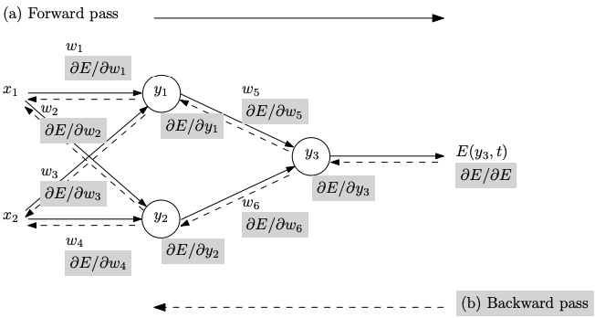

## Introduction

In this post, we shall deep dive into Tensorflow support for Differentiation using Gradient Tapes. Further explore the equations programmatically to understand the underlying capability.

In general differentiation can be accomplished through 4 techniques,

- Manual Differentiation
- Numerical Differentiation (ND)
- Symbolic Differentiation (SD)
- Automatic Differentiation (AutoDiff)

Both Numerical and Symbolic differentiations are considered as classical methods that are error prone. SD methods lead to inefficient code due to the challenges in converting a computer program into single expression. Meanwhile Numerical methods introduce round of errors due to discretization process(limits). Further, they are not suitable for gradient descent which is the backbone of Backpropation due to their inefficiency and performance bottleneck in computing partial derivatives. 


- Train inputs $x_i$ are fed forward, generating corresponding activations $y_i$
- An error E between the output $y_3$ and the target output $t$ is computed
- The error adjoint is propagated backward, giving the gradient with respect to the weights  
$\bigtriangledown_{wi}E = \left( \frac{\partial E}{\partial w_1}, \cdots, \frac {\partial E}{\partial w_6} \right)$  
which is subsequently used in a gradient-descent procedure
- The gradient wrt inputs $\bigtriangledown_{wi}E$ also be computed in the same backward pass

Image and Overview of Backpropagation Reference: [Automatic Differentiation
in Machine Learning: a Survey](https://arxiv.org/abs/1502.05767)

## Goal
I would consider the goal is accomplished, If one find answer to the following questions.
- What is Automatic Differentiation
- Where it is used?
- What is chain rule?
- How to find unknown differentiable equation from data?
- How to compute gradients?
- What is the significance of Gradient Tapes?
- Beyond equations, a programmatical implementation of the Auto Diff for few examples 


## Chain Rule
Chain rule is a formula to compute derivative of a composition of differentiable functions. To get an intuition, a differentiable function has a graph that is smooth and does not contain any break, angle or cusp.
Chain rule is often confused due to its application both in `Calculus` and `Probability`(joint distribution, conditional probability and Bayesian networks). 

$$\Large y = f(g(h(x)))) = f(g(h(w_{0}))) = f(g(w_{1})) = f(w_{2}) = w_{3}$$  

Where, $w_0 = x$, $w_1 = h(w_0)$, $w_2 = g(w_1)$, $w_3 = f(w_2) = y$  

then the chain rule gives  
$\Large \frac{dy}{dx} = \frac{dy}{dw_2} \frac{dw_2}{dw_1} \frac{dw_1}{dx}$  
$i.e$  
$\Large \frac{dy}{dx} = \frac{df(w_2)}{dw_2} \frac{dg(w_1)}{dw_1} \frac{dh(w_0)}{dx}$  


### Accumulations Methods
There are two modes through which AutoDiff is performed,
1. Forward Accumuation and
2. Backward Accumuation - Used in Backpropagation of errors in Multi Layer Perceptron Deep Neural Networks

An equation worth millions compared to explanation of any kind in this quest.

#### Forward Accumulation
In forward accumulation, chain rule traverses from inside to outside  
$\Large \frac{\partial y}{\partial x} = \frac{\partial y}{\partial w_{n-1}} \frac{\partial w_{n-1}}{dw_x}$  

$\Large \frac{\partial y}{\partial x} = \frac{\partial y}{\partial w_{n-1}} \left(\frac{\partial w_{n-1}}{dw_{n-2}} \frac{\partial w_{n-2}}{dw_x} \right)$  

$\Large \frac{\partial y}{\partial x} = \frac{\partial y}{\partial w_{n-1}} \left(\frac{\partial w_{n-1}}{dw_{n-2}} \left(\frac{\partial w_{n-2}}{dw_{n-3}} \frac{\partial w_{n-3}}{dw_x} \right) \right) = \dots$  

#### Reverse Accumulation
In reverse accumulation, chain rule traverses from outside to inside  

$\Large \frac{\partial y}{\partial x} = \frac{\partial y}{\partial w_1} \frac{\partial w_1}{dw_x}$  

$\Large \frac{\partial y}{\partial x} = \left( \frac{\partial y}{\partial w_2} \frac{\partial w_2}{dw_1} \right) \frac{\partial w_1}{dw_x} $  

$\Large \frac{\partial y}{\partial x} = \left(  \left( \frac{\partial y}{\partial w_3}\frac{\partial w_3}{dw_2}\right) \frac{\partial w_2}{dw_1} \right) \frac{\partial w_1}{dw_x} = \dots$  

## Automatic Differentiation using Tensorflow
We saw what is a differential equation, we also pondered the salience of Backward accumulation in Multi Layer Perceptrons. Our goal for a `Deep Neural Network(DNN)` model is to minimize the error of an unknown differentiable equation. What is this unknown differentiable equation is a separate topic for an other day.

Minimizing the error is achieved by finding a `local minima` of the differentiable equation iteratively using an optimization algorithm. This process is called as `Gradient Descent`. For few other problems, we might change the direction and find the `local maxima` and that process is called as `Gradient Ascent`.

During DNN training, two operations occurs `Forward Pass` and `Backward Pass`. To differentiate automatically, one need to remember what happened during the *forward pass* and while traversing back these operations happened are reversed to compute gradients. Tensorflow provides Gradient tapes to remember, A right analogy is like our olden day VHS tapes. Things are recorded at every step of training and can be reversed just by traversing back.

### Gradient Tapes
Tensorflow provided `tf.GradientTape` API for automatic differentiation to compute the gradient of certain inputs by recording the operations executed inside certain context. We shall examine this with few examples

### Calculate Derivatives
Let us see, how to calculate derivative for this simple equation
$$\frac{d}{dx}x^3 =3x^2$$
$$f'(x=1) = 3$$
$$f'(x=3) = 27$$


```python
import numpy as np
import tensorflow as tf

def derivative(value):
    x = tf.Variable([[value]])
    with tf.GradientTape() as tape:
        loss = x * x * x
        
        dy_dx = tape.gradient(loss, x)

    return dy_dx
```


```python
derive_1 = derivative(1.0)
derive_3 = derivative(3.0)
```


```python
print(f'f\'(𝑥=1) = {derive_1.numpy()}')
print(f'f\'(𝑥=3) = {derive_3.numpy()}')
```

    f'(𝑥=1) = [[3.]]
    f'(𝑥=3) = [[27.]]


### Calculate Derivative by Partial for Higher Rank Matrix
Let us say, We have a matrix of shape $2 \times 2$. That can be represented as $eqn.2$. 
We want to find the derivative of the square of that matrix. This is best done using partial derivative by assigning to a third variable $z$ ref $eqn.2$
$$y = \sum x$$
$$y=x_{1,1} + x_{1,2} + x_{2,1} + x_{2,2} \tag{1}$$
$$z=y^2\tag{2}$$


```python
x = tf.ones((2, 2))
x
```


    <tf.Tensor: shape=(2, 2), dtype=float32, numpy=
    array([[1., 1.],
           [1., 1.]], dtype=float32)>


From the chain rule

$$\frac{\partial z}{\partial x} = \frac{\partial z}{\partial y} \times \frac{\partial y}{\partial x}$$
from equation 2
$$\frac{\partial z}{\partial y} = 2 \times y = 8$$
from equation 1
$$\frac{\partial y}{\partial x}= \frac{\partial y}{\partial x_{1,1}}, \frac{\partial y}{\partial x_{1,2}}, \frac{\partial y}{\partial x_{2,1}}, \frac{\partial y}{\partial x_{2,2}}$$
$$\frac{\partial y}{\partial x}= [[1, 1], [1, 1]] $$
hence
$$\frac{\partial z}{\partial x} = \frac{\partial z}{\partial y} \times \frac{\partial y}{\partial x}$$
$$\frac{\partial z}{\partial x}  = 8 \times [[1, 1], [1, 1]] = [[8, 8], [8, 8]]$$


```python
with tf.GradientTape() as tape:
    tape.watch(x)
    y = tf.reduce_sum(x)
    z = tf.square(y)
    
dz_dx = tape.gradient(z, x)
```


```python
dz_dx
```


    <tf.Tensor: shape=(2, 2), dtype=float32, numpy=
    array([[8., 8.],
           [8., 8.]], dtype=float32)>


## Derivatives for Higher Degree Polynomial Equation

Let $x = 2$ and the 2nd degree polynomial equations as follows.

$$y = x^2 \tag{3}$$
$$z = y^2 \tag{4}$$

Using chain rule, Let us solve the derivative

$$\frac{\partial z}{\partial x} = \frac{\partial z}{\partial y} \times \frac{\partial y}{\partial x}$$
from equation 2
$$\frac{\partial z}{\partial y} = 2 \times y = 2 \times 3^2 = 18$$
$$\frac{\partial y}{\partial x} = 2x = 2 \times 3 = 6 \tag{5}$$
hence
$$\frac{\partial z}{\partial x} = \frac{\partial z}{\partial y} \times \frac{\partial y}{\partial x} = 18 \times 6 = 108 \tag{6}$$


*Solve the same by substitution*
$$\frac{\partial z}{\partial x}= \frac{\partial}{\partial x}x^4$$
$$\frac{\partial z}{\partial x}= 4x^3 = 4 \times 3^3 = 108 $$


```python
x = tf.constant(3.0)
with tf.GradientTape(persistent=True) as tape:
    tape.watch(x)
    y = x ** 2
    z = y ** 2
    
dz_dx = tape.gradient(z, x)
dy_dx = tape.gradient(y, x)
```


```python
print(f'∂𝑧/∂𝑥: {dz_dx}, ∂𝑦/∂𝑥: {dy_dx}')
```

    ∂𝑧/∂𝑥: 108.0, ∂𝑦/∂𝑥: 6.0


### Derivative of Derivative

$$y=x^3$$
$$\frac{\partial y}{\partial x} = 3x^2$$
$$\frac{\partial^2 y}{\partial x^2}=6x$$


```python
def derivative_of_derivative(x):
    x = tf.Variable(x, dtype=tf.float32)
    with tf.GradientTape() as tape_2:
        with tf.GradientTape() as tape_1:
            y = x ** 3
        dy_dx = tape_1.gradient(y, x)
    d2y_dx2 = tape_2.gradient(dy_dx, x)
    
    return dy_dx, d2y_dx2
```


```python
dy_dx, d2y_dx2 = derivative_of_derivative(1)
print(f'x=1 -- ∂𝑦/∂𝑥: {dy_dx}, ∂2𝑦∂𝑥2: {d2y_dx2}')

dy_dx, d2y_dx2 = derivative_of_derivative(5)
print(f'x=5 -- ∂𝑦/∂𝑥: {dy_dx}, ∂2𝑦∂𝑥2: {d2y_dx2}')
```

    x=1 -- ∂𝑦/∂𝑥: 3.0, ∂2𝑦∂𝑥2: 6.0
    x=5 -- ∂𝑦/∂𝑥: 75.0, ∂2𝑦∂𝑥2: 30.0


## Finding Unknown Differentiable Equation
Let us extract this function programmatically using `tf.GradientTapes`

$$y = 2x - 8 $$
$$\frac{dy}{dx} = 2 $$

Let us recreate this using `numpy` and `tensorflow` gradient tapes


```python
x = np.array(np.random.choice(15, size=10, replace=False), dtype=float)
y = 2 * x - 8
print(f"x: {x}\ny: {y}")
```

    x: [ 8. 10.  6.  3.  7.  9. 13.  1.  0. 11.]
    y: [ 8. 12.  4. -2.  6. 10. 18. -6. -8. 14.]


We have the data pattern for the above said equation. Through this dataset, let us find the equation by performing following steps
- The above equation is of the form $y = mx + b$, each instance is a point on the 2D plane that connects and forms a line
$$y = mx + b$$
- We have to train the variable $m$ the coefficient and $b$ the intercept. $m$ and $b$ using `tf.Variable`
- As mentioned above, our goal is the minimize the error by using an optimization function. A *loss*($loss_{fn}$) function using `tf.abs` of predicted $\hat y$ and actual $y$
- We have to compute this through multiple iterations. A *fit* functions using `tf.GradientTape` by iterating for `EPOCHS` time
- We also have a `LEARNING RATE` that is a constant


```python
LEARNING_RATE = 0.001
m = tf.Variable(np.random.random(), trainable=True)
c = tf.Variable(np.random.random(), trainable=True)

def loss_fn(y, y_hat):
    return tf.abs(y - y_hat)

def fit(x, y):
    with tf.GradientTape(persistent=True) as tape:
        # Predict y from data
        y_hat = m * x + c
        
        # Calculate the loss
        loss = loss_fn(y, y_hat)
        
    # Calculate Gradients
    m_gradient = tape.gradient(loss, m)
    c_gradient = tape.gradient(loss, c)
    
    # Update the Gradient and apply learning 
    m.assign_sub(m_gradient * LEARNING_RATE)
    c.assign_sub(c_gradient * LEARNING_RATE)
```


```python
EPOCHS = 2000
for i in range(EPOCHS):
    fit(x, y)
    if(i % 100 == 0):
        print(f'EPOCH: {i:04d}, m: {m.numpy()}, c: {c.numpy()}')
```

    EPOCH: 0000, m: 0.6082303524017334, c: 0.19983896613121033
    EPOCH: 0100, m: 1.1402301788330078, c: -0.1361609399318695
    EPOCH: 0200, m: 1.1762301921844482, c: -0.532161295413971
    EPOCH: 0300, m: 1.2302302122116089, c: -0.9261620044708252
    EPOCH: 0400, m: 1.2662302255630493, c: -1.3221579790115356
    EPOCH: 0500, m: 1.3022302389144897, c: -1.7181528806686401
    EPOCH: 0600, m: 1.3562302589416504, c: -2.1121480464935303
    EPOCH: 0700, m: 1.3922302722930908, c: -2.508143186569214
    EPOCH: 0800, m: 1.4462302923202515, c: -2.9021384716033936
    EPOCH: 0900, m: 1.482230305671692, c: -3.298133611679077
    EPOCH: 1000, m: 1.5362303256988525, c: -3.692128896713257
    EPOCH: 1100, m: 1.572230339050293, c: -4.08812952041626
    EPOCH: 1200, m: 1.6262303590774536, c: -4.482147216796875
    EPOCH: 1300, m: 1.662230372428894, c: -4.878165245056152
    EPOCH: 1400, m: 1.6982303857803345, c: -5.27418327331543
    EPOCH: 1500, m: 1.7522304058074951, c: -5.668200969696045
    EPOCH: 1600, m: 1.7882304191589355, c: -6.064218997955322
    EPOCH: 1700, m: 1.8402304649353027, c: -6.458236217498779
    EPOCH: 1800, m: 1.884230613708496, c: -6.8522515296936035
    EPOCH: 1900, m: 1.9182307720184326, c: -7.246265888214111


```python
print(f"y ~ {m.numpy()}x + {c.numpy()}")
```

    y ~ 1.9022306203842163x + -7.554266452789307


Hence, 
$$\Huge y \sim 1.92x - 7.22$$
$$\Huge \simeq$$
$$\Huge y = 2x - 8 $$

## Inference
1. Have we found the polynomial function programmatically using Gradient Tapes? - YES
2. Are we able to differentiate polynomial equation of various degrees? - YES
3. Are we able to compute gradeints using Gradient Tape? - Yes
4. Have we established the relationship between Chain Rule and Gradient Descent? - YES
5. Have we achieved our goals? - If YES, I request you to promote this blog by a tweet or a linkedin share. It means a lot to me.

Thank You

## References 
> [Automatic Differentiation and Gradients](https://www.tensorflow.org/guide/autodiff)  
> [Differentiable Functions](http://www.math.uri.edu/~mcomerford/math141/Fall11/lesson13.pdf)  
> [Automatic Differentiation in Machine Learning: a Survey](https://arxiv.org/pdf/1502.05767.pdf)  


```python

```
