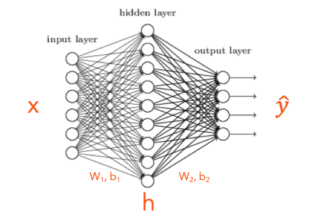

```python
from IPython.display import Image
```

# Forward and Backpropagation Algorithm

An associated source code will be published shortly.

In this post, we shall explore a shallow Dense Neural Network(DNN) with 
- an Input Layer
- a Single Hidden Layer and
- an Output Layer

The typical architecture of a feed forward network has the above units. 
Where 
- $x$ is a vector that represents the input values, 
- $\hat y$ is a vector that represents the predictions and 
- $h$ is vector that represents the hidden layer, $h$ is a hyperparameter selected based on the context of the problem

Further to the above 3 parameters, connection weights $[W_1, W_2]$ and connection biases $[b_1, b_2]$ are the other matrices and vectors used in a DNN

## Architecture of a Shallow DNN
**6 Inputs, 9 Hidden Nodes, 4 Outputs**


```python
display(Image("/kaggle/input/sample-images/shallow-dnn.png"))
```





Following are the processes we shall cover in the quest of understanding a simple Neural Network architecture,  
- Forward Propagation
- Cross Entropy Loss (covered in a separate post)
- Activation Functions
    - Softmax
    - ReLU
- Backpropagation
- Gradient Descent
- Extraction of features of the hidden layer

From the above Diagram...
- There are 6 Inputs of dimension $(I \times 1)$ ie (6 X 1)
- There are 9 nodes in the Hidden Layer of dimension $(N \times 1)$ ie (9 X 1)
- There are 4 nodes in the Output Layer of dimension $(O \times 1)$ ie (4 X 1)

## Forward Propagation
From the inputs and weights, biases of the hidden layer, 
$$z_1 = W_1x + b_1 \tag{1}$$
$$h = ReLU(z_1) \tag{2}$$
From hidden layer ($h$) and weights, biases to the output layer
$$z_2 = W_2h + b_2 \tag{3}$$
$$\hat y = softmax(z_2) \tag{4}$$

### Dimension Analysis
How to select the weights, let us do dimensionality reduction
Let us examine the dimensions of all elements in the equation 1
$$z_1 = W_1h + b_1$$
$$dimensions$$
$$N \times 1 = [?, ?] \times [I, 1] + [?, ?]$$
$$naturally$$
$$N \times 1 = [N, I] \times [I, 1] + [N, 1]$$
$$hence$$
$$9 \times 1 = [9, 6] \times [6, 1] + [9, 1]$$
Hence $N \times I $ is the dimension of the weight matrix $W_1$


Let us examine the dimensions of all elements in the equation 2
$$z_2 = W_2h + b_2$$
$$dimensions$$
$$O \times 1 = [?, ?] \times [N, 1] + [?, ?]$$
$$then$$
$$O \times 1 = [O, N] \times [N, 1] + [O, 1]$$
$$hence$$
$$4 \times 1 = [4, 9] \times [9, 1] + [4, 1]$$
Hence $O \times N $ is the dimension of the weight matrix $W_2$

## Cross Entropy Loss
Our goal is to minimize the loss $J$
$$J = - \sum\limits_{k=1}^V y_k \log\hat y_k \tag{5}$$ 
[Cost(Loss) Function for Binary Classification - A Deep Dive](https://www.linkedin.com/pulse/costloss-function-binary-classification-gowri-shankar/)

## Backpropagation - Pull your sleeves and do some partial derivatives
We calculated the $\hat y$ during forward propagation and now our goal is to optimize the weights by minimizing the loss. This is done by calculating the partial derivatives wrt $[W_2, b_2]$ and then $[W_1, b_1]$
$$\frac{\partial J}{\partial W_1} = ReLU\left( W^T_2(\hat y - y)\right)x^T \tag{6}$$
$$\frac{\partial J}{\partial W_2} = (\hat y - y)h^T \tag{7}$$
$$\frac{\partial J}{\partial b_1} = ReLU\left(W^T_2(\hat y - y)\right) \tag{8}$$
$$\frac{\partial J}{\partial b_2} = \hat y - y \tag{9}$$

## Gradient Descent
Gradient descent is the process during which the weights and biases are updated by subtracting $\alpha$ times the learning rate of calculated gradients from the original matrices and biases

$$W_1 := W_1 - \alpha\frac{\partial J}{\partial {W_{1}}} \tag{10}$$
$$W_2 := W_2 - \alpha\frac{\partial J}{\partial W_2} \tag{11}$$
$$b_1 := b_1 - \alpha\frac{\partial J}{\partial b_1} \tag{12}$$
$$b_2 := b_2 - \alpha\frac{\partial J}{\partial b_2} \tag{13}$$

[Demystifying Gradient Descent - A Deep Dive](https://www.linkedin.com/pulse/demystifying-gradient-descent-classification-problem-gowri-shankar/)


```python

```
