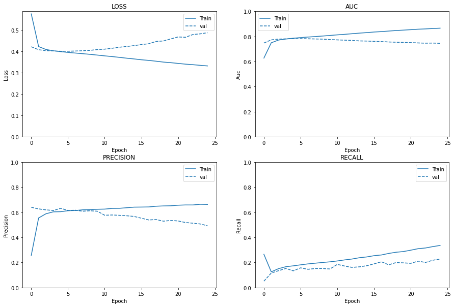
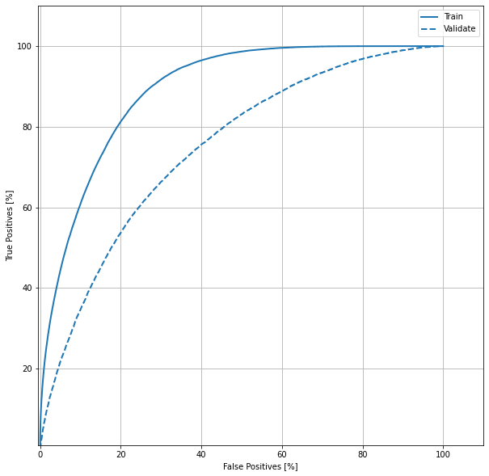
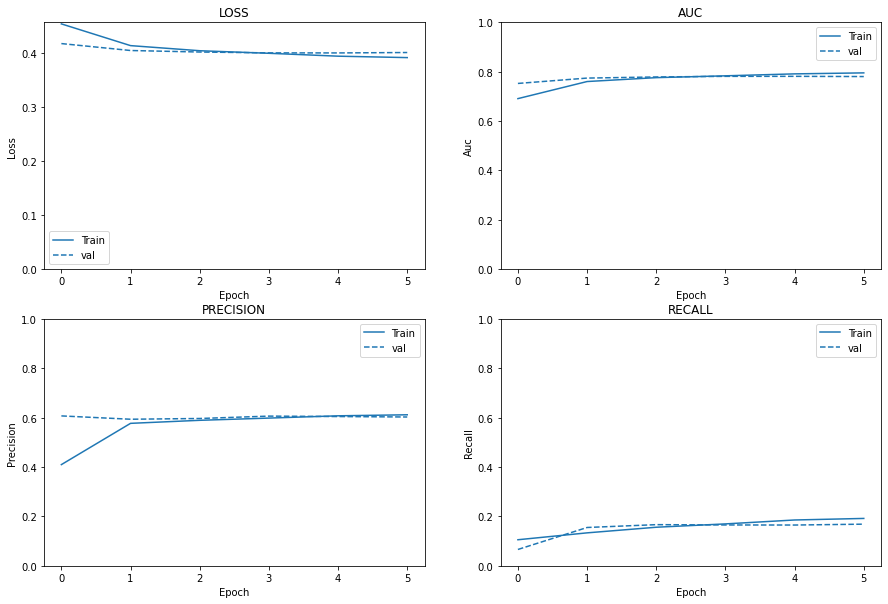
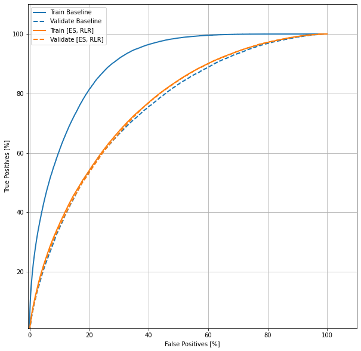
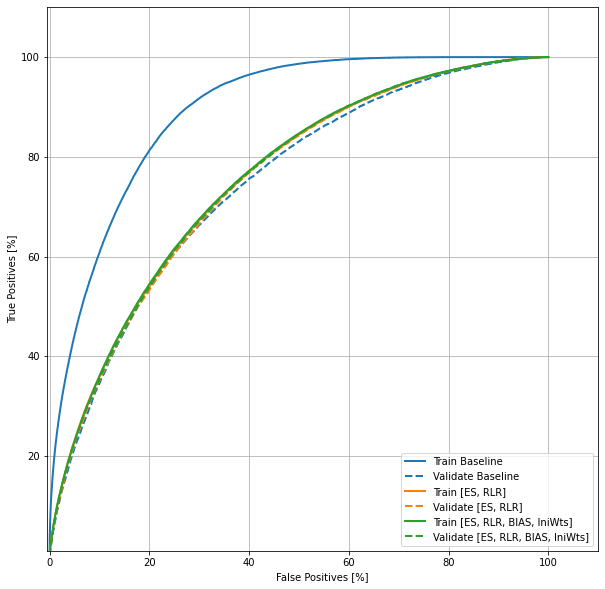

### Objective
The key objective of this kernel is 
- To introduce the new programming style for creating a neural network using Keras on TF2
- One should be capable of starting Deep Learning without going through the conventional way of ML algorithms and landing here eventually. Ref:[Learn ML - ML101, Rank 4500 to ~450 in a day](https://www.kaggle.com/gowrishankarin/learn-ml-ml101-rank-4500-to-450-in-a-day)
- Instill knowledge on key principles includes
    - Train, Validation and Test data splitting
    - A simple mechanism to fill the missing values in the dataset
    - Bias and Overfit handlers like class weights and initial bias calculation
    - Handling categorical columns using One Hot Encoding or Embedding principles
    - Elegant way of creating dataset of tensor slices from pandas dataframes
    - Build a simple and flat a NN architecture using Keras
    - Predict the targets via predict functions
    - Analyse the results using various metrics include accuracy, precision, ROC curve etc

This is an attempt to make an engineer novice to expert on approach and process of building a neural network for classification problem.


```python
from __future__ import absolute_import, division, print_function, unicode_literals

import numpy as np
import pandas as pd

import tensorflow as tf
from sklearn.model_selection import train_test_split
```

## Pre-Processing

### Read Data
- Read the data from the data source using Pandas package.
- We have 3 files - train.csv, test.csv and sample_submission.csv
- Train set has 23 feature columns and 60,000 observations
- Test set has 23 feature columns and 40,000 observations

Hint: 
- Test set volume is huge, there is a chance of imbalance target value. Ensure it is handled to avoid bias.
- Also note, if the data is imbalanced - Right metrics is AUC(area under the curve) and not accuracy.


```python
is_local = False
INPUT_DIR = "/kaggle/input/cat-in-the-dat-ii/"

import tensorflow as tf; 
print(tf.__version__)

if(is_local):
    INPUT_DIR = "../input/"

import os
for dirname, _, filenames in os.walk(INPUT_DIR):
    for filename in filenames:
        print(os.path.join(dirname, filename))

# Any results you write to the current directory are saved as output.
```

    2.1.0
    /kaggle/input/cat-in-the-dat-ii/train.csv
    /kaggle/input/cat-in-the-dat-ii/test.csv
    /kaggle/input/cat-in-the-dat-ii/sample_submission.csv


```python
train_df = pd.read_csv(INPUT_DIR + "train.csv")
test_df = pd.read_csv(INPUT_DIR + "test.csv")
submission_df = pd.read_csv(INPUT_DIR + "sample_submission.csv")
print("Shape of the train data is ", train_df.shape)
print("Shape of the test data is ", test_df.shape)

train_df.head()
```

    Shape of the train data is  (600000, 25)
    Shape of the test data is  (400000, 24)


<div>
<style scoped>
    .dataframe tbody tr th:only-of-type {
        vertical-align: middle;
    }

    .dataframe tbody tr th {
        vertical-align: top;
    }

    .dataframe thead th {
        text-align: right;
    }
</style>
<table border="1" class="dataframe">
  <thead>
    <tr style="text-align: right;">
      <th></th>
      <th>id</th>
      <th>bin_0</th>
      <th>bin_1</th>
      <th>bin_2</th>
      <th>bin_3</th>
      <th>bin_4</th>
      <th>nom_0</th>
      <th>nom_1</th>
      <th>nom_2</th>
      <th>nom_3</th>
      <th>...</th>
      <th>nom_9</th>
      <th>ord_0</th>
      <th>ord_1</th>
      <th>ord_2</th>
      <th>ord_3</th>
      <th>ord_4</th>
      <th>ord_5</th>
      <th>day</th>
      <th>month</th>
      <th>target</th>
    </tr>
  </thead>
  <tbody>
    <tr>
      <th>0</th>
      <td>0</td>
      <td>0.0</td>
      <td>0.0</td>
      <td>0.0</td>
      <td>F</td>
      <td>N</td>
      <td>Red</td>
      <td>Trapezoid</td>
      <td>Hamster</td>
      <td>Russia</td>
      <td>...</td>
      <td>02e7c8990</td>
      <td>3.0</td>
      <td>Contributor</td>
      <td>Hot</td>
      <td>c</td>
      <td>U</td>
      <td>Pw</td>
      <td>6.0</td>
      <td>3.0</td>
      <td>0</td>
    </tr>
    <tr>
      <th>1</th>
      <td>1</td>
      <td>1.0</td>
      <td>1.0</td>
      <td>0.0</td>
      <td>F</td>
      <td>Y</td>
      <td>Red</td>
      <td>Star</td>
      <td>Axolotl</td>
      <td>NaN</td>
      <td>...</td>
      <td>f37df64af</td>
      <td>3.0</td>
      <td>Grandmaster</td>
      <td>Warm</td>
      <td>e</td>
      <td>X</td>
      <td>pE</td>
      <td>7.0</td>
      <td>7.0</td>
      <td>0</td>
    </tr>
    <tr>
      <th>2</th>
      <td>2</td>
      <td>0.0</td>
      <td>1.0</td>
      <td>0.0</td>
      <td>F</td>
      <td>N</td>
      <td>Red</td>
      <td>NaN</td>
      <td>Hamster</td>
      <td>Canada</td>
      <td>...</td>
      <td>NaN</td>
      <td>3.0</td>
      <td>NaN</td>
      <td>Freezing</td>
      <td>n</td>
      <td>P</td>
      <td>eN</td>
      <td>5.0</td>
      <td>9.0</td>
      <td>0</td>
    </tr>
    <tr>
      <th>3</th>
      <td>3</td>
      <td>NaN</td>
      <td>0.0</td>
      <td>0.0</td>
      <td>F</td>
      <td>N</td>
      <td>Red</td>
      <td>Circle</td>
      <td>Hamster</td>
      <td>Finland</td>
      <td>...</td>
      <td>f9d456e57</td>
      <td>1.0</td>
      <td>Novice</td>
      <td>Lava Hot</td>
      <td>a</td>
      <td>C</td>
      <td>NaN</td>
      <td>3.0</td>
      <td>3.0</td>
      <td>0</td>
    </tr>
    <tr>
      <th>4</th>
      <td>4</td>
      <td>0.0</td>
      <td>NaN</td>
      <td>0.0</td>
      <td>T</td>
      <td>N</td>
      <td>Red</td>
      <td>Triangle</td>
      <td>Hamster</td>
      <td>Costa Rica</td>
      <td>...</td>
      <td>c5361037c</td>
      <td>3.0</td>
      <td>Grandmaster</td>
      <td>Cold</td>
      <td>h</td>
      <td>C</td>
      <td>OZ</td>
      <td>5.0</td>
      <td>12.0</td>
      <td>0</td>
    </tr>
  </tbody>
</table>
<p>5 rows × 25 columns</p>
</div>


### Constants
Let us initialize the constants 

- **Embedding Dimensions:** An embedding a low-dimensional space into which a high dimensional vector is represented. 
    It makes a large space of information into a sparse vectors. 
    Here we are randomly picking 9 dimensions to represent the sparse vector of certain features. More about embeddings below.
- **Batch Size:** Batch size tells the network, the number of observations to propagate through the networks. The key aspect of the batch size is 
    how quickly a model trains/learns.
- **Epochs:** Epoch is the number of times a learning algorithms is iterated on the entire training data set. ie Count of every observation in the training dataset
    involved in the learning process of the model. 
- **Train and Validation Split:** A model is better if it is generalized rather than work well for the given dataset. So the train dataset is split into train and validation data. During the training process, accuracy of the model is measured through validation data metrics rather than train.
- **Metrics:** We are observing 8 metrics to understand a model. Ref: [Precision, Recall, ROC, AUC - Validation Metrics](https://www.kaggle.com/gowrishankarin/precision-recall-roc-auc-validation-metrics)


```python
EMBEDDING_DIMENSIONS=9
BATCH_SIZE = 1024
EPOCHS = 25
TRAIN_VAL_SPLIT_RATIO = 0.3

METRICS = [
    tf.keras.metrics.TruePositives(name='tp'),
    tf.keras.metrics.FalsePositives(name='fp'),
    tf.keras.metrics.TrueNegatives(name='tn'),
    tf.keras.metrics.FalseNegatives(name='fn'),
    tf.keras.metrics.BinaryAccuracy(name='accuracy'),
    tf.keras.metrics.Precision(name='precision'),
    tf.keras.metrics.Recall(name='recall'),
    tf.keras.metrics.AUC(name='auc'),
]

```

## Understanding the Features
Understanding the dataset by doing an **Exploratory Data Analysis and Visualization** brings significant insights for solving the problem. Ref: [Interactive EDA using Plotly](https://www.kaggle.com/gowrishankarin/interactive-eda-using-plotly)  
In our dataset, we have 5 types of features
- Binary Data - Discrete (1, 0) or (True, False), (Yes, No)
- Nominal Data - Discrete (Male, Female) or (Eye Colors) or (Hair Color)
- Ordinal Data - Discrete Sequence (Hot, Hotter, Hottest) or (Scale of 1-10)
- Cyclic Data - Continuous, Numeric (Weekdays) or (Month Dates)
- Target Data - Our target data is a binary data


```python
COLUMN_TYPES = {
    'id': 'index',
    'bin_0': 'binary', 'bin_1': 'binary', 'bin_2': 'binary', 'bin_3': 'binary', 
    'bin_4': 'binary', 'nom_0': 'categorical', 'nom_1': 'categorical',
    'nom_2': 'categorical', 'nom_3': 'categorical', 'nom_4': 'categorical', 
    'nom_5': 'categorical', 'nom_6': 'categorical', 'nom_7': 'categorical', 
    'nom_8': 'categorical', 'nom_9': 'categorical',
    'ord_0': 'ordinal', 'ord_1': 'ordinal', 'ord_2': 'ordinal', 
    'ord_3': 'ordinal', 'ord_4': 'ordinal', 'ord_5': 'ordinal', 
    'day': 'cyclic', 'month': 'cyclic',
    'target': 'target'
}
```

### Dealing with Missing Data
The most time consuming aspect of a dataset is dealing with missing data. We are presenting a simple way to address with this
- All categorical and binary data are filled with a special value NaN
- Cyclic data is filled with the median value for simplicity

There are sophisticated imputation mechanisms available in sklearn packages. Ref: [Fancy Impute](https://github.com/iskandr/fancyimpute), [sklearn.impute](https://scikit-learn.org/stable/modules/classes.html#module-sklearn.impute)


```python
def fill_missing_values(dataframe, ignore_cols=['id', 'target']):
    feature_cols = [column for column in dataframe.columns if column not in ignore_cols]
    for a_column in feature_cols:
        typee = COLUMN_TYPES[a_column]
        if(typee == 'binary'):
            dataframe.loc[:, a_column] = dataframe.loc[:, a_column].astype(str).fillna(-9999999)
        elif(typee == 'numeric'):
            pass
        elif(typee == 'categorical'):
            dataframe.loc[:, a_column] = dataframe.loc[:, a_column].astype(str).fillna(-9999999)
        elif(typee == 'ordinal'):
            dataframe.loc[:, a_column] = dataframe.loc[:, a_column].astype(str).fillna(-9999999)
        elif(typee == 'cyclic'):
            median_val = np.median(dataframe[a_column].values)
            if(np.isnan(median_val)):
                median_val = np.median(dataframe[~np.isnan(dataframe[a_column])][a_column].values)
            print(a_column, median_val)
            dataframe.loc[:, a_column] = dataframe.loc[:, a_column].astype(float).fillna(median_val)
            
    return dataframe.copy(deep=True)

train_df = fill_missing_values(train_df, ignore_cols=['id', 'target'])
test_df = fill_missing_values(test_df, ignore_cols=['id'])
```

    day 5.0
    month 6.0
    day 5.0
    month 6.0


## Bias and Class Weights
- Our goal is to avoid overfitting and generalization of the model we create.
- As a first measure we split the data into train and validation set
- Further we shall intervene by calculating initial bias and class weights
- How to find imbalance in the target value
    - Find the ratio of positive and negatives in the target distribution
    - In our dataset, we have 18.72 percent are positives and rest are negatives
    - We assume a similar behavior in the test dataset as well
    - However there is no guarantee that it will be true
    
### Initial Bias
Since the dataset is imbalanced, our output layer to reflect the bias. Bias can be calculated as follows

\begin{equation*}
p_0 = \frac{pos}{pos + neg} = \frac{1}{1 + b^0} \\
b_0 = - log_e(\frac{1}{p_0} - 1) \\
b_0 = log_e(\frac{pos}{neg})
\end{equation*}

With this inialization, Initial loss/cost function or **cross entropy**

<div align="center" style="font-size: 18px">Loss/Cost Function or Cross Entropy</div><br>


\begin{equation*}
- p_0 log(p_0) - (1 - p_0) log(1 - p_0)
\end{equation*}


```python
def get_initial_bias(df, col_name='target'):
    neg, pos = np.bincount(df[col_name])
    total = neg + pos
    print('Examples:\n    Total: {}\n    Positive: {} ({:.2f}% of total)\n'.format(
        total, pos, 100 * pos / total))

    initial_bias = np.log([pos/neg])
    
    return initial_bias


initial_bias = get_initial_bias(train_df)

```

    Examples:
        Total: 600000
        Positive: 112323 (18.72% of total)
    


### Class Weights
- The idea is to have the model heavily weight the few positive option available for training. 
- This is done using "class_weight" param of the model to pay more attention towards under represented class. 
- Incorporation of class weights is made aware through the cost function
- The loss/cost function discussed earlier transform as follows

<div align="center" style="font-size: 18px">Weighted Cost Entropy</div><br>

\begin{equation*}
- w_0 p_0 log(p_0) - w1 (1 - p_0) log(1 - p_0)
\end{equation*}


```python
def get_class_weights(df, col_name='target'):
    neg, pos = np.bincount(df[col_name])
    weight_for_0 = (1 / neg) * (neg + pos) / 2.0
    weight_for_1 = (1 / pos) * (neg + pos) / 2.0

    class_weight = {
        0: weight_for_0,
        1: weight_for_1
    }

    print("Class 0: ", weight_for_0, "Weightage")
    print("Class 1: ", weight_for_1, "Weightage")
    
    return class_weight

class_weight = get_class_weights(train_df)
```

    Class 0:  0.6151612645254954 Weightage
    Class 1:  2.6708688336315802 Weightage


## Stratified Split of Train and Validation Data
To avoid Sampling bias, we shall split the data using Stratification. Stratified split ensure the imbalance ratio is maintained in train and validation dataset.

What is Sampling Bias?  
When some members of the population have lower sampling probability than others, a sampling bias occurs. 
It results in samples favoring a particular group of the population and the model end up with bias.


```python
### Stratified Split

from sklearn.model_selection import StratifiedShuffleSplit

def split_train_validation_data(df, col_name='target', stratify=True, test_size=0.3):
    train = None
    val = None
    
    if(stratify):
        

        sss = StratifiedShuffleSplit(n_splits=2, test_size=0.2, random_state=21)
        sss.get_n_splits(df, df.target)

        splits = sss.split(df, df.target) 
        
        indices = []
        for train_index, test_index in splits:
            indices.append({
                'train': train_index,
                'test': test_index
            })

        train = df.iloc[indices[0]['train']]
        val = df.iloc[indices[0]['test']]
        
    else:
        train, val = train_test_split(train_df, test_size=test_size)
    return train, val

train, val = split_train_validation_data(train_df, test_size=TRAIN_VAL_SPLIT_RATIO)
```


```python
get_initial_bias(train)
get_initial_bias(val)

```

    Examples:
        Total: 480000
        Positive: 89858 (18.72% of total)
    
    Examples:
        Total: 120000
        Positive: 22465 (18.72% of total)
    


    array([-1.46825275])


## Tensorflow 2 - Feature Columns
- Tensorflow feature columns are the most awesome capability released recently
- Feature columns are the bridge between raw data and the neural network operated data
- What kind of data a NN will operate on - Numbers, mostly floating point numbers
- How to translate the categorical columns like the few we discussed earlier. eg Color of eye, Gender, All retail shops of a market etc
- The rich nature of feature columns enable one to transform diverse range of raw format to NN operatable format
- Naturally, the output of the feature column becomes the input to the model.


## One Hot Encoding
- For Categorical features, transformation of non-number data to number data is the goal
- Categorical variables are nominal, The process of transforming into binary value is One Hot Encoding
- The raw data in long format is converted into wide format
- It is nothing but, binarization of a categorical values

|Company   	|Rank   	|Price   	|   	|   	|
|:-:	|:-:	|:-:	|:-:	|:-:	|
|VW   	|4   	|   	|100   	|   	|
|Honda   	|2   	|   	|10000   	|   	|
|Ford   	|3   	|   	|1000   	|   	|
|Tesla   	|1   	|   	|100000   	|   	|

<div align="center" style="font-size: 30px">TO</div>

|Company   	|Rank 1  	|Rank 2   	|Rank 3   	|Rank 4   	|Price   	|
|:-:	|:-:	|:-:	|:-:	|:-:	|:-:	|
|VW   	|0   	|0   	|0   	|1   	|100   	|
|Honda   	|0   	|1   	|0   	|0   	|10000   	|
|Ford   	|0   	|0   	|1   	|0   	|1000   	|
|Tesla   	|1   	|0   	|0   	|0   	|100000   	|


## Embeddings
- Another popular scheme used for transformation of categorical variables into numbers is embeddings.
- This scheme represents discrete values as continuous vectors
- This process for machine translation yields significan improvement to the model performance
- In an NN, embeddings are low-dimensional continuous vectors
- The reduction of dimensionality of a categorical variable and meaningful representation in the transformed space is the goal
- Dimensionality reduction addresses the high cardinality of the categorical value
- Embeddings place the similar things closer in the embedding space

Examples  
1. Books on Data Science: Let us say there are 20000 books covering the wide gamut of all data science problems. Actual number of dimension here is 2000. By reducing the dimensonality of the dataset, From 20000 to 200 - We can represent the whole dataset.
2. Retail Outlets of a Country: Let us say there are 1.2 million retail outlets present in a country. 1000 odd number can represent the characteristics can represent the attributes of every outlet.

**Representation of Embedding with 2 vectors**
<pre><code>
shops = ["Sainsbury", "Tesco", "Reliance", "Lulu", "Costco"]  
embeddings = [
    [ 0.11, 0.52],  
    [0.32, 0.56], 
    [-0.56, -0.91], 
    [-0.21, 0.21]
]
</code></pre>                
Here we reduced the dimensionality to 2 from 5 to represent the property of a variable

### Numeric Columns
Numeric columns are pretty straight forword where the raw data is already with numeric value. Feature columns of TF2's numeric_column api comes handy to address the problem


### Random Decisions
- If the variation is less than 100 on the categorical columns, One Hot Encoding taken in this code
- Beyond 100 variation, Embeddings are preferred


```python
def handle_feature_columns(df, columns_to_remove=['id', 'target'], all_categorical_as_ohe=True):
    
    def demo(feature_column):
        feature_layer = tf.keras.layers.DenseFeatures(feature_column)
    
    def one_hot_encode(col_name, unique_values):
        from_vocab = tf.feature_column.categorical_column_with_vocabulary_list(
            col_name, unique_values
        )
        ohe = tf.feature_column.indicator_column(from_vocab)
        data.append(ohe)
        demo(ohe)
    
    def embedd(col_name, unique_values):
        from_vocab = tf.feature_column.categorical_column_with_vocabulary_list(
            col_name, unique_values
        )
        embeddings = tf.feature_column.embedding_column(from_vocab, dimension=EMBEDDING_DIMENSIONS)
        data.append(embeddings)
        demo(embeddings)
        
    def numeric(col_name, unique_values):
        from_numeric = tf.feature_column.numeric_column(
            col_name, dtype=tf.float32
        )
        data.append(from_numeric)
        demo(from_numeric)
    
    dataframe = df.copy()
    for pop_col in columns_to_remove:
        dataframe.pop(pop_col)
    data = []
    
    for a_column in dataframe.columns:
        typee = COLUMN_TYPES[a_column]
        nunique = dataframe[a_column].nunique()
        unique_values = dataframe[a_column].unique()
        print('Column :', a_column, nunique, unique_values[:10])                
        if(typee == 'binary'):
            one_hot_encode(a_column, unique_values)
        elif(typee == 'cyclic'):
            numeric(a_column, unique_values)
            
        else:
            if(all_categorical_as_ohe):
                one_hot_encode(a_column, unique_values)
            else:
                if(typee == 'categorical'):
                    if(nunique < 100):
                        one_hot_encode(a_column, unique_values)
                    else:
                        embedd(a_column, unique_values)
                elif(typee == 'ordinal'):
                    embedd(a_column, unique_values)
            
    return data
```


```python
feature_columns = handle_feature_columns(train, all_categorical_as_ohe=False)
```

    Column : bin_0 3 ['nan' '0.0' '1.0']
    Column : bin_1 3 ['nan' '0.0' '1.0']
    Column : bin_2 3 ['0.0' '1.0' 'nan']
    Column : bin_3 3 ['F' 'T' 'nan']
    Column : bin_4 3 ['nan' 'N' 'Y']
    Column : nom_0 4 ['Red' 'Green' 'Blue' 'nan']
    Column : nom_1 7 ['Polygon' 'Triangle' 'Trapezoid' 'Square' 'Circle' 'nan' 'Star']
    Column : nom_2 7 ['Hamster' 'Axolotl' 'nan' 'Cat' 'Lion' 'Dog' 'Snake']
    Column : nom_3 7 ['Russia' 'India' 'Costa Rica' 'Finland' 'China' 'Canada' 'nan']
    Column : nom_4 5 ['Bassoon' 'Theremin' 'Piano' 'Oboe' 'nan']
    Column : nom_5 1221 ['a256e9af4' '92fe4617b' '540b0e83b' 'ef8280dc7' 'cff330adf' '0664ab302'
     '7fa2dc49f' '08ab6d513' '9e2b2d267' 'a7d8c3224']
    Column : nom_6 1518 ['b1a44e651' '688e92338' 'c8dbebb84' '62489fe7b' '5a8141d0e' 'a54000801'
     '7327dbe21' '69ca248d6' 'b3c631ddb' 'd5007ac35']
    Column : nom_7 223 ['ba9faf5b1' 'bc9cc2a94' 'cf84cbe77' 'f313d1e52' '580231f65' '83bdea3a5'
     'a7059911d' '8781919c2' 'cb47f665d' 'd8c3cfd78']
    Column : nom_8 223 ['95414620e' '45121db5e' 'd48e8b7af' 'nan' 'b42763706' '43e0ac7a1'
     '9789d425f' 'c9bbbb717' '798ccea46' '5859a8a06']
    Column : nom_9 2218 ['nan' '51909bae5' 'bba491958' 'c44ea5ea9' 'b813f2af5' '1ccbcbdc7'
     '146bbb38b' '07d718459' '1d54b2cc1' '0b5e0c54c']
    Column : ord_0 4 ['1.0' '2.0' 'nan' '3.0']
    Column : ord_1 6 ['Master' 'Novice' 'Contributor' 'Grandmaster' 'nan' 'Expert']
    Column : ord_2 7 ['Warm' 'Lava Hot' 'Freezing' 'Cold' 'Hot' 'Boiling Hot' 'nan']
    Column : ord_3 16 ['e' 'h' 'd' 'i' 'c' 'n' 'o' 'f' 'b' 'a']
    Column : ord_4 27 ['R' 'K' 'P' 'M' 'N' 'A' 'Q' 'H' 'D' 'T']
    Column : ord_5 191 ['ok' 'Ib' 'Rv' 'TL' 'hG' 'hT' 'aE' 'MX' 'gc' 'Ji']
    Column : day 7 [5. 3. 1. 7. 2. 6. 4.]
    Column : month 12 [ 7.  4. 10.  8.  3.  9. 12.  5.  1.  2.]


### Data Preparation
Tensors are the centrol data types for a Tensorflow NN framework. Crafting a tensors for the feature columns ensures the raw data translation into model acceptable one.
Simply speaking, a tensor is a multi-dimensional numerical array. To get full picture of a tensor, we have to understand few key words
- **Rank:** Number of dimension of a tensor is its Rank.
- **Shape:** Shape of a tenser is its count of rows and columns.
    - A rank zero tensor is a single number or it is a **scalar**
    - A rank one tensor is an array of numbers or it is called as **vector**
    - A rank two tensor is a matrix of numers or it has rows and columns
- **Tensor Slice:** A tensor slice is a portion of data from the population based the batch size given


```python
y_train = train.pop('target')
y_val = val.pop('target')
```


```python
def df_to_dataset(dataframe, y, shuffle=True, batch_size=32, is_test_data=False):
    dataframe = dataframe.copy()
    ds = None
    if(is_test_data):
        ds = tf.data.Dataset.from_tensor_slices(dict(dataframe))
    else:
        
        ds = tf.data.Dataset.from_tensor_slices((dict(dataframe), y))
        if(shuffle):
            ds = ds.shuffle(buffer_size=len(dataframe))
    ds = ds.batch(batch_size)
    return ds

train_ds = df_to_dataset(train, y_train, shuffle=False, batch_size=BATCH_SIZE)
val_ds = df_to_dataset(val, y_val, shuffle=False, batch_size=BATCH_SIZE)
test_ds = df_to_dataset(test_df, None, shuffle=False, batch_size=BATCH_SIZE, is_test_data=True)
```

## Model, Training and Prediction
Once the dataset is ready, a model is created, trained and evaluated.
The current model has 6 unique items stacked one after another... {WIP}

- **Sequential Model:** 
- **Feature Layer:**
- **Dense Layer:**
- **Batch Normalization:**
- **Dropouts:**
- **Activation Function - Relu:**
- **Activation Function - Sigmoid:**
- **Loss Function: Binary Cross Entropy:**
- **From Logits:**
- **Optimizer - Adam:**


```python
def create_silly_model_2(feature_layer, initial_bias=None):
    bias = None
    if(initial_bias):
        bias = tf.keras.initializers.Constant(initial_bias)
        
    model = tf.keras.Sequential([
        feature_layer,
        tf.keras.layers.Dense(512, activation='relu'),
        tf.keras.layers.Dropout(0.3),
        tf.keras.layers.BatchNormalization(),
        tf.keras.layers.Dense(256, activation='relu'),
        tf.keras.layers.Dropout(0.3),
        tf.keras.layers.BatchNormalization(),
        tf.keras.layers.Dense(128, activation='relu'),
        tf.keras.layers.Dropout(0.3),
        tf.keras.layers.BatchNormalization(),
        tf.keras.layers.Dense(1, activation='sigmoid', bias_initializer=bias)
    ])
    model.compile(
        optimizer='adam',
        loss=tf.keras.losses.BinaryCrossentropy(from_logits=False),
        metrics=METRICS
    )
    return model
```

### Fit and Run the Model
To run the model, we have 14 items to ensure {WIP}
- **Callbacks:**
- **Early Stopping:**
- **Reduce Learning on Plateau**
- **Accuracy Monitoring:**
- **Patience:**
- **Baseline:**
- **Restore Best Weights:**
- **History:**


```python

def run(
    train_data, val_data, feature_columns, 
    epochs=EPOCHS, es=False, rlr=False, 
    class_weights=None, initial_bias=None
):
    feature_layer = tf.keras.layers.DenseFeatures(feature_columns)
    model = create_silly_model_2(feature_layer, initial_bias)

    callbacks = []
    if(es):
        callbacks.append(
            tf.keras.callbacks.EarlyStopping(
                monitor='val_auc', min_delta=0.00001, patience=5, 
                mode='auto', verbose=1, baseline=None, restore_best_weights=True
            )
        )
    if(rlr):
        callbacks.append(
            tf.keras.callbacks.ReduceLROnPlateau(
                monitor='val_auc', factor=0.5, patience=3, 
                min_lr=3e-6, mode='auto', verbose=1
            )
        )

    history = model.fit(
        train_ds, 
        validation_data=val_ds, 
        epochs=epochs, 
        callbacks=callbacks,
        class_weight=class_weights
    )
    
    return model, history
```


```python
model, history = run(
    train_ds, val_ds, feature_columns, 
    epochs=EPOCHS, es=False, rlr=False, 
    class_weights=None, initial_bias=None
)
```

    Train for 469 steps, validate for 118 steps
    Epoch 1/25
    469/469 [==============================] - 33s 71ms/step - loss: 0.5749 - tp: 23812.0000 - fp: 68890.0000 - tn: 321252.0000 - fn: 66046.0000 - accuracy: 0.7189 - precision: 0.2569 - recall: 0.2650 - auc: 0.6274 - val_loss: 0.4213 - val_tp: 1147.0000 - val_fp: 647.0000 - val_tn: 96888.0000 - val_fn: 21318.0000 - val_accuracy: 0.8170 - val_precision: 0.6394 - val_recall: 0.0511 - val_auc: 0.7473
    Epoch 2/25
    469/469 [==============================] - 25s 53ms/step - loss: 0.4222 - tp: 11273.0000 - fp: 9061.0000 - tn: 381081.0000 - fn: 78585.0000 - accuracy: 0.8174 - precision: 0.5544 - recall: 0.1255 - auc: 0.7493 - val_loss: 0.4074 - val_tp: 2598.0000 - val_fp: 1549.0000 - val_tn: 95986.0000 - val_fn: 19867.0000 - val_accuracy: 0.8215 - val_precision: 0.6265 - val_recall: 0.1156 - val_auc: 0.7723
    Epoch 3/25
    469/469 [==============================] - 25s 53ms/step - loss: 0.4085 - tp: 13544.0000 - fp: 9504.0000 - tn: 380638.0000 - fn: 76314.0000 - accuracy: 0.8212 - precision: 0.5876 - recall: 0.1507 - auc: 0.7710 - val_loss: 0.4031 - val_tp: 3026.0000 - val_fp: 1863.0000 - val_tn: 95672.0000 - val_fn: 19439.0000 - val_accuracy: 0.8225 - val_precision: 0.6189 - val_recall: 0.1347 - val_auc: 0.7784
    Epoch 4/25
    469/469 [==============================] - 25s 54ms/step - loss: 0.4025 - tp: 14942.0000 - fp: 9834.0000 - tn: 380308.0000 - fn: 74916.0000 - accuracy: 0.8234 - precision: 0.6031 - recall: 0.1663 - auc: 0.7793 - val_loss: 0.4016 - val_tp: 3427.0000 - val_fp: 2158.0000 - val_tn: 95377.0000 - val_fn: 19038.0000 - val_accuracy: 0.8234 - val_precision: 0.6136 - val_recall: 0.1525 - val_auc: 0.7806
    Epoch 5/25
    469/469 [==============================] - 25s 53ms/step - loss: 0.3985 - tp: 15553.0000 - fp: 10184.0000 - tn: 379958.0000 - fn: 74305.0000 - accuracy: 0.8240 - precision: 0.6043 - recall: 0.1731 - auc: 0.7854 - val_loss: 0.4005 - val_tp: 2993.0000 - val_fp: 1749.0000 - val_tn: 95786.0000 - val_fn: 19472.0000 - val_accuracy: 0.8232 - val_precision: 0.6312 - val_recall: 0.1332 - val_auc: 0.7821
    Epoch 6/25
    469/469 [==============================] - 25s 54ms/step - loss: 0.3948 - tp: 16272.0000 - fp: 10312.0000 - tn: 379830.0000 - fn: 73586.0000 - accuracy: 0.8252 - precision: 0.6121 - recall: 0.1811 - auc: 0.7905 - val_loss: 0.4004 - val_tp: 3529.0000 - val_fp: 2217.0000 - val_tn: 95318.0000 - val_fn: 18936.0000 - val_accuracy: 0.8237 - val_precision: 0.6142 - val_recall: 0.1571 - val_auc: 0.7820
    Epoch 7/25
    469/469 [==============================] - 25s 53ms/step - loss: 0.3918 - tp: 16942.0000 - fp: 10669.0000 - tn: 379473.0000 - fn: 72916.0000 - accuracy: 0.8259 - precision: 0.6136 - recall: 0.1885 - auc: 0.7948 - val_loss: 0.4013 - val_tp: 3272.0000 - val_fp: 2037.0000 - val_tn: 95498.0000 - val_fn: 19193.0000 - val_accuracy: 0.8231 - val_precision: 0.6163 - val_recall: 0.1456 - val_auc: 0.7810
    Epoch 8/25
    469/469 [==============================] - 25s 53ms/step - loss: 0.3889 - tp: 17452.0000 - fp: 10732.0000 - tn: 379410.0000 - fn: 72406.0000 - accuracy: 0.8268 - precision: 0.6192 - recall: 0.1942 - auc: 0.7988 - val_loss: 0.4026 - val_tp: 3409.0000 - val_fp: 2198.0000 - val_tn: 95337.0000 - val_fn: 19056.0000 - val_accuracy: 0.8229 - val_precision: 0.6080 - val_recall: 0.1517 - val_auc: 0.7797
    Epoch 9/25
    469/469 [==============================] - 25s 52ms/step - loss: 0.3858 - tp: 17965.0000 - fp: 10993.0000 - tn: 379149.0000 - fn: 71893.0000 - accuracy: 0.8273 - precision: 0.6204 - recall: 0.1999 - auc: 0.8030 - val_loss: 0.4044 - val_tp: 3413.0000 - val_fp: 2166.0000 - val_tn: 95369.0000 - val_fn: 19052.0000 - val_accuracy: 0.8232 - val_precision: 0.6118 - val_recall: 0.1519 - val_auc: 0.7782
    Epoch 10/25
    469/469 [==============================] - 25s 53ms/step - loss: 0.3823 - tp: 18428.0000 - fp: 11131.0000 - tn: 379011.0000 - fn: 71430.0000 - accuracy: 0.8280 - precision: 0.6234 - recall: 0.2051 - auc: 0.8076 - val_loss: 0.4082 - val_tp: 3330.0000 - val_fp: 2146.0000 - val_tn: 95389.0000 - val_fn: 19135.0000 - val_accuracy: 0.8227 - val_precision: 0.6081 - val_recall: 0.1482 - val_auc: 0.7750
    Epoch 11/25
    469/469 [==============================] - 25s 54ms/step - loss: 0.3787 - tp: 19055.0000 - fp: 11439.0000 - tn: 378703.0000 - fn: 70803.0000 - accuracy: 0.8287 - precision: 0.6249 - recall: 0.2121 - auc: 0.8124 - val_loss: 0.4101 - val_tp: 4147.0000 - val_fp: 3054.0000 - val_tn: 94481.0000 - val_fn: 18318.0000 - val_accuracy: 0.8219 - val_precision: 0.5759 - val_recall: 0.1846 - val_auc: 0.7722
    Epoch 12/25
    469/469 [==============================] - 25s 53ms/step - loss: 0.3754 - tp: 19808.0000 - fp: 11611.0000 - tn: 378531.0000 - fn: 70050.0000 - accuracy: 0.8299 - precision: 0.6304 - recall: 0.2204 - auc: 0.8165 - val_loss: 0.4142 - val_tp: 3852.0000 - val_fp: 2812.0000 - val_tn: 94723.0000 - val_fn: 18613.0000 - val_accuracy: 0.8215 - val_precision: 0.5780 - val_recall: 0.1715 - val_auc: 0.7701
    Epoch 13/25
    469/469 [==============================] - 25s 54ms/step - loss: 0.3717 - tp: 20435.0000 - fp: 11942.0000 - tn: 378200.0000 - fn: 69423.0000 - accuracy: 0.8305 - precision: 0.6312 - recall: 0.2274 - auc: 0.8213 - val_loss: 0.4191 - val_tp: 3611.0000 - val_fp: 2664.0000 - val_tn: 94871.0000 - val_fn: 18854.0000 - val_accuracy: 0.8207 - val_precision: 0.5755 - val_recall: 0.1607 - val_auc: 0.7680
    Epoch 14/25
    469/469 [==============================] - 25s 53ms/step - loss: 0.3678 - tp: 21362.0000 - fp: 12238.0000 - tn: 377904.0000 - fn: 68496.0000 - accuracy: 0.8318 - precision: 0.6358 - recall: 0.2377 - auc: 0.8261 - val_loss: 0.4227 - val_tp: 3710.0000 - val_fp: 2777.0000 - val_tn: 94758.0000 - val_fn: 18755.0000 - val_accuracy: 0.8206 - val_precision: 0.5719 - val_recall: 0.1651 - val_auc: 0.7641
    Epoch 15/25
    469/469 [==============================] - 25s 53ms/step - loss: 0.3643 - tp: 21929.0000 - fp: 12313.0000 - tn: 377829.0000 - fn: 67929.0000 - accuracy: 0.8328 - precision: 0.6404 - recall: 0.2440 - auc: 0.8301 - val_loss: 0.4265 - val_tp: 3909.0000 - val_fp: 2992.0000 - val_tn: 94543.0000 - val_fn: 18556.0000 - val_accuracy: 0.8204 - val_precision: 0.5664 - val_recall: 0.1740 - val_auc: 0.7630
    Epoch 16/25
    469/469 [==============================] - 25s 53ms/step - loss: 0.3537 - tp: 24442.0000 - fp: 13295.0000 - tn: 376847.0000 - fn: 65416.0000 - accuracy: 0.8360 - precision: 0.6477 - recall: 0.2720 - auc: 0.8425 - val_loss: 0.4461 - val_tp: 4072.0000 - val_fp: 3445.0000 - val_tn: 94090.0000 - val_fn: 18393.0000 - val_accuracy: 0.8180 - val_precision: 0.5417 - val_recall: 0.1813 - val_auc: 0.7557
    Epoch 19/25
    469/469 [==============================] - 24s 52ms/step - loss: 0.3496 - tp: 25285.0000 - fp: 13602.0000 - tn: 376540.0000 - fn: 64573.0000 - accuracy: 0.8371 - precision: 0.6502 - recall: 0.2814 - auc: 0.8468 - val_loss: 0.4484 - val_tp: 4476.0000 - val_fp: 3987.0000 - val_tn: 93548.0000 - val_fn: 17989.0000 - val_accuracy: 0.8169 - val_precision: 0.5289 - val_recall: 0.1992 - val_auc: 0.7534
    Epoch 20/25
    469/469 [==============================] - 25s 52ms/step - loss: 0.3469 - tp: 25787.0000 - fp: 13805.0000 - tn: 376337.0000 - fn: 64071.0000 - accuracy: 0.8378 - precision: 0.6513 - recall: 0.2870 - auc: 0.8500 - val_loss: 0.4579 - val_tp: 4421.0000 - val_fp: 3853.0000 - val_tn: 93682.0000 - val_fn: 18044.0000 - val_accuracy: 0.8175 - val_precision: 0.5343 - val_recall: 0.1968 - val_auc: 0.7518
    Epoch 21/25
    469/469 [==============================] - 24s 52ms/step - loss: 0.3434 - tp: 26762.0000 - fp: 14046.0000 - tn: 376096.0000 - fn: 63096.0000 - accuracy: 0.8393 - precision: 0.6558 - recall: 0.2978 - auc: 0.8536 - val_loss: 0.4671 - val_tp: 4338.0000 - val_fp: 3838.0000 - val_tn: 93697.0000 - val_fn: 18127.0000 - val_accuracy: 0.8170 - val_precision: 0.5306 - val_recall: 0.1931 - val_auc: 0.7506
    Epoch 22/25
    469/469 [==============================] - 24s 52ms/step - loss: 0.3399 - tp: 27827.0000 - fp: 14468.0000 - tn: 375674.0000 - fn: 62031.0000 - accuracy: 0.8406 - precision: 0.6579 - recall: 0.3097 - auc: 0.8573 - val_loss: 0.4654 - val_tp: 4735.0000 - val_fp: 4405.0000 - val_tn: 93130.0000 - val_fn: 17730.0000 - val_accuracy: 0.8155 - val_precision: 0.5181 - val_recall: 0.2108 - val_auc: 0.7480
    Epoch 23/25
    469/469 [==============================] - 25s 53ms/step - loss: 0.3375 - tp: 28330.0000 - fp: 14735.0000 - tn: 375407.0000 - fn: 61528.0000 - accuracy: 0.8411 - precision: 0.6578 - recall: 0.3153 - auc: 0.8597 - val_loss: 0.4783 - val_tp: 4489.0000 - val_fp: 4265.0000 - val_tn: 93270.0000 - val_fn: 17976.0000 - val_accuracy: 0.8147 - val_precision: 0.5128 - val_recall: 0.1998 - val_auc: 0.7460
    Epoch 24/25
    469/469 [==============================] - 24s 52ms/step - loss: 0.3344 - tp: 29311.0000 - fp: 14883.0000 - tn: 375259.0000 - fn: 60547.0000 - accuracy: 0.8429 - precision: 0.6632 - recall: 0.3262 - auc: 0.8628 - val_loss: 0.4816 - val_tp: 4894.0000 - val_fp: 4764.0000 - val_tn: 92771.0000 - val_fn: 17571.0000 - val_accuracy: 0.8139 - val_precision: 0.5067 - val_recall: 0.2178 - val_auc: 0.7471
    Epoch 25/25
    469/469 [==============================] - 25s 52ms/step - loss: 0.3317 - tp: 30159.0000 - fp: 15392.0000 - tn: 374750.0000 - fn: 59699.0000 - accuracy: 0.8436 - precision: 0.6621 - recall: 0.3356 - auc: 0.8655 - val_loss: 0.4868 - val_tp: 5103.0000 - val_fp: 5261.0000 - val_tn: 92274.0000 - val_fn: 17362.0000 - val_accuracy: 0.8115 - val_precision: 0.4924 - val_recall: 0.2272 - val_auc: 0.7446


```python
predictions = model.predict(test_ds)
submit = pd.DataFrame()
submit["id"] = test_df["id"]
submit['target'] = predictions
submit.to_csv('submission_dl_stratify.csv', index=False)
```

## Model Performance and Metrics
- A model is rated through various metrics and the list we saw in the data preparation part. These metrics gives us an opportunity get insight over the model's performance.
- The primary goal of building a model is to avoid overfit over the training data. Achieving a high accuracy on train data almost always result in poor performance over the real data
- That is nothing but the neural network failed to learn the critical patterns hidden deeply inside the dataset.
- Training for longer time will result in overfit. That is control over the number of epochs.

In this section we shall plot the following metrics across train and validation datasets
- Loss
- AUC, Area Under the Curve
- Precision
- Recall

Further we shall draw the ROC(Receiver Operating Curve) and observe the model performance from the training history.


```python
import matplotlib as mpl
import matplotlib.pyplot as plt
mpl.rcParams['figure.figsize'] = (15, 10)
colors = plt.rcParams['axes.prop_cycle'].by_key()['color']
```


```python
def plot_metrics(history):
    metrics = ['loss', 'auc', 'precision', 'recall']
    
    for n, metric in enumerate(metrics):
        name = metric.replace("_", " ").capitalize()
        plt.subplot(2, 2, n+1)
        plt.plot(
            history.epoch, 
            history.history[metric], 
            color=colors[0], 
            label='Train'
        )
        plt.plot(
            history.epoch, 
            history.history['val_' + metric], 
            color=colors[0], 
            linestyle="--", 
            label='val'
        )
        plt.title(metric.upper())
        plt.xlabel('Epoch')
        plt.ylabel(name)
        if(metric == 'loss'):
            plt.ylim([0, plt.ylim()[1]])
        elif(metric == 'auc'):
            plt.ylim([0, 1])
        else:
            plt.ylim([0, 1])
        plt.legend()
        
plot_metrics(history)
```





### Observations
**Loss:**  
    Loss of validation dataset to go down, inference: overfitting  
**Area Under the Curve(AUC):**  
    AUC of validation dataset to be more than train set, inference: overfitting  
**Precision:**   
    Precision of Validation and Train to be similar, inference: overfitting  
**Recall:**   
    Recall progression validation set to be along or above the train set: overfitting  

## ROC - Receiver Operating Characteristics
For a binary classification problems, a ROC curve illustrates the ability of the model to predict the actual.
- It is plotted between True Positive Rate(TPR) and False Positive Rate(FPR)
- TPR is probability of predicting rightly
- FPR is the probability of a false prediction
- ROC's goal is to play as a tool to select optimal models


```python
train_predictions = model.predict(train_ds)
val_predictions = model.predict(val_ds)
```


```python
from sklearn import metrics

def roc(name, labels, predictions, **kwargs):
    fp, tp, _ = metrics.roc_curve(labels, predictions)
    
    plt.plot(100*fp, 100*tp, label=name, linewidth=2, **kwargs)
    plt.xlabel('False Positives [%]')
    plt.ylabel('True Positives [%]')
    plt.xlim([-0.5, 110])
    plt.ylim([1, 110])
    plt.grid(True)
    ax = plt.gca()
    ax.set_aspect('equal')
    plt.legend()


```


```python
roc('Train', y_train, train_predictions, color=colors[0])
roc('Validate', y_val, val_predictions, color=colors[0], linestyle='--')
```





## Intervention 1: Early Stopping and Reduce Learning Rate on Plateau
Let us try to fix the overfitting problem by
- Early stop the training and
- Reduce learning rate when a plateau is encountered


```python
model, history = run(
    train_ds, val_ds, feature_columns, 
    epochs=EPOCHS, es=True, rlr=True, 
    class_weights=None, initial_bias=None
)
```

    Train for 469 steps, validate for 118 steps
    Epoch 1/25
    469/469 [==============================] - 32s 69ms/step - loss: 0.4544 - tp: 9475.0000 - fp: 13661.0000 - tn: 376481.0000 - fn: 80383.0000 - accuracy: 0.8041 - precision: 0.4095 - recall: 0.1054 - auc: 0.6907 - val_loss: 0.4179 - val_tp: 1485.0000 - val_fp: 963.0000 - val_tn: 96572.0000 - val_fn: 20980.0000 - val_accuracy: 0.8171 - val_precision: 0.6066 - val_recall: 0.0661 - val_auc: 0.7522
    Epoch 2/25
    469/469 [==============================] - 25s 54ms/step - loss: 0.4141 - tp: 11979.0000 - fp: 8799.0000 - tn: 381343.0000 - fn: 77879.0000 - accuracy: 0.8194 - precision: 0.5765 - recall: 0.1333 - auc: 0.7599 - val_loss: 0.4051 - val_tp: 3483.0000 - val_fp: 2389.0000 - val_tn: 95146.0000 - val_fn: 18982.0000 - val_accuracy: 0.8219 - val_precision: 0.5932 - val_recall: 0.1550 - val_auc: 0.7738
    Epoch 3/25
    469/469 [==============================] - 25s 54ms/step - loss: 0.4047 - tp: 14024.0000 - fp: 9794.0000 - tn: 380348.0000 - fn: 75834.0000 - accuracy: 0.8216 - precision: 0.5888 - recall: 0.1561 - auc: 0.7756 - val_loss: 0.4023 - val_tp: 3741.0000 - val_fp: 2534.0000 - val_tn: 95001.0000 - val_fn: 18724.0000 - val_accuracy: 0.8228 - val_precision: 0.5962 - val_recall: 0.1665 - val_auc: 0.7784
    Epoch 4/25
    468/469 [============================>.] - ETA: 0s - loss: 0.4000 - tp: 15217.0000 - fp: 10236.0000 - tn: 379266.0000 - fn: 74513.0000 - accuracy: 0.8232 - precision: 0.5978 - recall: 0.1696 - auc: 0.7830
    Epoch 00004: ReduceLROnPlateau reducing learning rate to 0.0005000000237487257.
    469/469 [==============================] - 26s 56ms/step - loss: 0.3999 - tp: 15238.0000 - fp: 10252.0000 - tn: 379890.0000 - fn: 74620.0000 - accuracy: 0.8232 - precision: 0.5978 - recall: 0.1696 - auc: 0.7830 - val_loss: 0.4007 - val_tp: 3713.0000 - val_fp: 2416.0000 - val_tn: 95119.0000 - val_fn: 18752.0000 - val_accuracy: 0.8236 - val_precision: 0.6058 - val_recall: 0.1653 - val_auc: 0.7809
    Epoch 5/25
    469/469 [==============================] - 25s 52ms/step - loss: 0.3946 - tp: 16660.0000 - fp: 10785.0000 - tn: 379357.0000 - fn: 73198.0000 - accuracy: 0.8250 - precision: 0.6070 - recall: 0.1854 - auc: 0.7909 - val_loss: 0.4006 - val_tp: 3706.0000 - val_fp: 2429.0000 - val_tn: 95106.0000 - val_fn: 18759.0000 - val_accuracy: 0.8234 - val_precision: 0.6041 - val_recall: 0.1650 - val_auc: 0.7809
    Epoch 6/25
    468/469 [============================>.] - ETA: 0s - loss: 0.3920 - tp: 17201.0000 - fp: 10941.0000 - tn: 378561.0000 - fn: 72529.0000 - accuracy: 0.8258 - precision: 0.6112 - recall: 0.1917 - auc: 0.7949Restoring model weights from the end of the best epoch.
    469/469 [==============================] - 25s 53ms/step - loss: 0.3919 - tp: 17227.0000 - fp: 10959.0000 - tn: 379183.0000 - fn: 72631.0000 - accuracy: 0.8259 - precision: 0.6112 - recall: 0.1917 - auc: 0.7949 - val_loss: 0.4014 - val_tp: 3786.0000 - val_fp: 2501.0000 - val_tn: 95034.0000 - val_fn: 18679.0000 - val_accuracy: 0.8235 - val_precision: 0.6022 - val_recall: 0.1685 - val_auc: 0.7800
    Epoch 00006: early stopping


## Plot Metrics: Loss vs AUC vs Precision vs Recall


```python
plot_metrics(history)
```





### Observations
**Loss:**  
    Loss of validation dataset got better compared to earlier, inference: overfitting is addressed to some extent  
**Area Under the Curve(AUC):**  
    AUC of validation dataset is increased compared to earlier, inference: overfitting is addressed to some extent  
**Precision:**   
    No significant change to precision, inference: overfitting  
**Recall:**   
    Recall of train and validation set are overalapping: overfitting  


```python
train_predictions_es_rlr = model.predict(train_ds)
val_predictions_es_rlr = model.predict(val_ds)
```

### ROC comparison
Let us compare the baseline model results with the model having intervention of Early Stopping and RLR


```python

roc('Train Baseline', y_train, train_predictions, color=colors[0])
roc('Validate Baseline', y_val, val_predictions, color=colors[0], linestyle='--')
roc('Train [ES, RLR]', y_train, train_predictions_es_rlr, color=colors[1])
roc('Validate [ES, RLR]', y_val, val_predictions_es_rlr, color=colors[1], linestyle='--')
```





## Intervention 2: Class Weights and Initial Bias
Let us try to fix further the overfitting problem by
- Incorporating Class Weights and
- Initial Bias


```python
model, history = run(
    train_ds, val_ds, feature_columns, 
    epochs=EPOCHS, es=True, rlr=True, 
    class_weights=class_weight, initial_bias=initial_bias
)
```

    Train for 469 steps, validate for 118 steps
    Epoch 1/25
    469/469 [==============================] - 39s 83ms/step - loss: 0.6565 - tp: 57523.0000 - fp: 135960.0000 - tn: 254182.0000 - fn: 32335.0000 - accuracy: 0.6494 - precision: 0.2973 - recall: 0.6402 - auc: 0.6976 - val_loss: 0.5864 - val_tp: 16562.0000 - val_fp: 35511.0000 - val_tn: 62024.0000 - val_fn: 5903.0000 - val_accuracy: 0.6549 - val_precision: 0.3181 - val_recall: 0.7372 - val_auc: 0.7543
    Epoch 2/25
    469/469 [==============================] - 25s 53ms/step - loss: 0.5836 - tp: 65473.0000 - fp: 133975.0000 - tn: 256167.0000 - fn: 24385.0000 - accuracy: 0.6701 - precision: 0.3283 - recall: 0.7286 - auc: 0.7593 - val_loss: 0.5675 - val_tp: 16852.0000 - val_fp: 33630.0000 - val_tn: 63905.0000 - val_fn: 5613.0000 - val_accuracy: 0.6730 - val_precision: 0.3338 - val_recall: 0.7501 - val_auc: 0.7741
    Epoch 3/25
    469/469 [==============================] - 25s 53ms/step - loss: 0.5677 - tp: 66423.0000 - fp: 129345.0000 - tn: 260797.0000 - fn: 23435.0000 - accuracy: 0.6817 - precision: 0.3393 - recall: 0.7392 - auc: 0.7748 - val_loss: 0.5635 - val_tp: 17278.0000 - val_fp: 34884.0000 - val_tn: 62651.0000 - val_fn: 5187.0000 - val_accuracy: 0.6661 - val_precision: 0.3312 - val_recall: 0.7691 - val_auc: 0.7785
    Epoch 4/25
    467/469 [============================>.] - ETA: 0s - loss: 0.5602 - tp: 66906.0000 - fp: 128032.0000 - tn: 260626.0000 - fn: 22644.0000 - accuracy: 0.6849 - precision: 0.3432 - recall: 0.7471 - auc: 0.7815
    Epoch 00004: ReduceLROnPlateau reducing learning rate to 0.0005000000237487257.
    469/469 [==============================] - 25s 53ms/step - loss: 0.5601 - tp: 67136.0000 - fp: 128535.0000 - tn: 261607.0000 - fn: 22722.0000 - accuracy: 0.6849 - precision: 0.3431 - recall: 0.7471 - auc: 0.7815 - val_loss: 0.5615 - val_tp: 17298.0000 - val_fp: 34676.0000 - val_tn: 62859.0000 - val_fn: 5167.0000 - val_accuracy: 0.6680 - val_precision: 0.3328 - val_recall: 0.7700 - val_auc: 0.7806
    Epoch 5/25
    469/469 [==============================] - 25s 53ms/step - loss: 0.5519 - tp: 68210.0000 - fp: 128319.0000 - tn: 261823.0000 - fn: 21648.0000 - accuracy: 0.6876 - precision: 0.3471 - recall: 0.7591 - auc: 0.7886 - val_loss: 0.5612 - val_tp: 16851.0000 - val_fp: 32538.0000 - val_tn: 64997.0000 - val_fn: 5614.0000 - val_accuracy: 0.6821 - val_precision: 0.3412 - val_recall: 0.7501 - val_auc: 0.7812
    Epoch 6/25
    467/469 [============================>.] - ETA: 0s - loss: 0.5468 - tp: 68500.0000 - fp: 128116.0000 - tn: 260542.0000 - fn: 21050.0000 - accuracy: 0.6881 - precision: 0.3484 - recall: 0.7649 - auc: 0.7929Restoring model weights from the end of the best epoch.
    469/469 [==============================] - 25s 53ms/step - loss: 0.5467 - tp: 68740.0000 - fp: 128614.0000 - tn: 261528.0000 - fn: 21118.0000 - accuracy: 0.6881 - precision: 0.3483 - recall: 0.7650 - auc: 0.7929 - val_loss: 0.5629 - val_tp: 17026.0000 - val_fp: 33360.0000 - val_tn: 64175.0000 - val_fn: 5439.0000 - val_accuracy: 0.6767 - val_precision: 0.3379 - val_recall: 0.7579 - val_auc: 0.7807
    Epoch 00006: early stopping


```python
plot_metrics(history)
```


### Observations
**Loss:**  
    Loss increased compared to earlier, inference: overfitting, model degraded  
**Area Under the Curve(AUC):**  
    AUC of previous and current intervention remain same, inference: no improvement  
**Precision:**   
    Precision decreased from earlier, inference: model degraded  
**Recall:**   
    Recall increased: model degraded  


```python
train_predictions_bias_cws = model.predict(train_ds)
val_predictions_bias_cws = model.predict(val_ds)
```


```python
roc('Train Baseline', y_train, train_predictions, color=colors[0])
roc('Validate Baseline', y_val, val_predictions, color=colors[0], linestyle='--')
roc('Train [ES, RLR]', y_train, train_predictions_es_rlr, color=colors[1])
roc('Validate [ES, RLR]', y_val, val_predictions_es_rlr, color=colors[1], linestyle='--')
roc('Train [ES, RLR, BIAS, IniWts]', y_train, train_predictions_bias_cws, color=colors[2])
roc('Validate [ES, RLR, BIAS, IniWts]', y_val, val_predictions_bias_cws, color=colors[2], linestyle='--')
```





## Inference of Interventions
Intervention 1 improved the model but intervention 2 did not make any significant change to the model performance. 


```python
predictions = model.predict(test_ds)
submit = pd.DataFrame()
submit["id"] = test_df["id"]
submit['target'] = predictions
submit.to_csv('submission_dl_final.csv', index=False)
```
