## Story Behind
<font color='blue'>It’s the job that’s never started as takes longest to finish.</font> - **<font color='red'>Samwise Gamgee</font>**

Of late I noticed my folks are struggling on performance optimization while building a high throughput machine for a mission critical application.
This notebook might give some idea on how to approach compute complexity and avoid obvious bottlenecks in an abstract fashion.

There is a good chance one might seek an external reference to comprehend this notebook fully. 

### Disclaimers
- Cases are presented in abstraction
- Intent is to avoid disputes due to comparison of entities, operations and ideas
- Concrete examples are given but at algebraic level for human comprehension
- Artefacts like databases, storage and compute are not spoken - **Concrete Entities**
- Limitations of relational storage, indexing of labels for optimized retrievals are not spoken - **Concrete Operations**
- Which is better, SQL or NoSQL or Maps and Reduces etc are not spoken - **Concrete Ideas**

## Rules
<font color='blue'>All we have to decide is what to do with the time that is given to us</font> - **<font color='red'>Gandalf the Grey</font>**

<h3><center>
<div>5 rules to share the lifetime, </div> 
<div>2 says what to be omitted,  </div> 
<div>3 says what grows faster,  </div> 
<div>and they all govern the time given to us.</div> 
</center></h3>

They are  
- Multiplicative Constants can be omitted
- Out of 2 polynomials, one with larger degree grows faster
- Any polynomial grows slower than any exponential
- Any polyalgorithm grows slower than any polynomial
- Smaller terms can be omitted

#### Big-O Notations
Intent of this notebook is to explore briefly the computation complexity through polynomial functions and
- Visualize the order of growth of frequently used functions in the algorithmic analysis  
- Interactive(Using Jupyter Notebook) to play around with it  
- Plug in your function of choice  


#### Definitions
- Consider 2 functions f(n) and g(n) that defined for all positive integers and take on non-negative values
- Frequently used functions:  
\begin{equation*}
log(n) \\
sqrt(n) \\
n log(n) \\
n^3 \\
2^n \\
\end{equation*}
- Let us say, f grows slower than g and f < g. ie f(n)/g(n) -> 0  as n grows  
- f grows no faster than g, f <= g. ie for all n
\begin{equation*}
f(n) ⪯ c.g(n)
\end{equation*}

#### Remarks
**One**
- f < g is same as f = o(g) and f<= g is same as f = O(g)  
- Confusion 5n^2 = O(n^3) ie 5n^2 grows no faster than n^2 and slower than O(n^3)  
- ie 5n^2 <= n^2 and 5n^2 <= n^3  

**Two**
- If f < g, f ⪯ g. Lol if f grows slower than g, f certainly grows no faster than g  

**Three**
- Symbol is ⪯ not ≤ because it is fancy


```python
%matplotlib inline
import matplotlib.pyplot as plt
import numpy as np
```

## Introduction: Growth of a Polynomial Function 
<font color='blue'>It is not the strength of the body, but the strength of the spirit.</font> - **<font color='red'>J.R.R. Tolkien</font>**

- Growth of a second order ploymial function or a quadratic equation with 3 coefficients.
- Plot is rendered on a larger space of 100 observations
\begin{equation*}
f(n) = 7n^2 + 6n + 5
\end{equation*}


```python
n = np.linspace(1, 100)
plt.plot(n, 7*n*n + 6*n + 5)
plt.show()
```


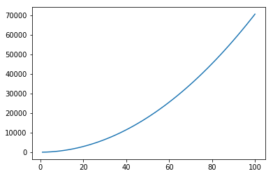


**Compare a 2nd and 1st order function**
- Growth is observed in a large space of 100 observations
- Difference is huge and the 1st order equation looks almost flat
- Graph is deceiving us
\begin{equation*}
f(n) = 7n^2 + 6n + 5 \\
vs \\
f(n) = 20n \\
\end{equation*}


```python
plt.plot(n, 7*n*n + 6*n + 5, label="7n^2 + 6n +5")
plt.plot(n, 20 * n, label="20n")
plt.legend(loc="upper left")
plt.show()
```


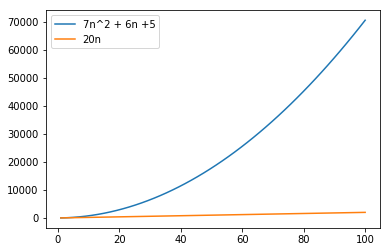


- Growth is observed for 1st order equation in the smaller space of 10 observations
- Difference is significant and the 1st order equation growth is not looking bad


```python
n = np.linspace(1, 10)
plt.plot(n, 7*n*n + 6*n + 5, label="7n^2 + 6n +5")
plt.plot(n, 20 * n, label="20n")
plt.legend(loc="upper left")
plt.show()
```


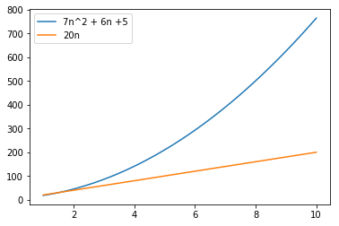


## Definitions: 5 Rules
<font color='blue'>A hunted man sometimes wearies of distrust and longs for friendship.</font> - **<font color='red'>Aragorn</font>**

Common rules of comparing the order of growth of functions - Arising frequently in Algorithm Analysis  
**RULE 1: Multiplicative Constants can be omitted**  
for example ,   
\begin{equation*}
c.f ⪯ f \\
\end{equation*} 
examples
\begin{equation*}
5n^2 ⪯ n^2 \\
n^2/3 ⪯ n^2 \\
\end{equation*}  

**RULE 2: Out of 2 polynomials, one with larger degree grows faster**  
\begin{equation*}
n^a⪯n^b  \\
for \\
0≤a≤b \\
\end{equation*}
Examples: 
\begin{equation*}
n≺n^2 \\ 
\sqrt{n}≺n^2/3 \\ 
n^2≺n^3 \\
n^0≺\sqrt{n}  
\end{equation*}  

**RULE 3: Any polynomial grows slower than any exponential** 
\begin{equation*}
n^a≺b^n  \\
for \\
a≥0 \\
b>1 
\end{equation*}
Examples: 
\begin{equation*}
n^3≺2^n \\
n^{10}≺1.1^n  
\end{equation*}  

**RULE 4: Any polyalgorithm grows slower than any polynomial**    
\begin{equation*}
logn^a≺n^b  \\
for  \\
a,b>0 
\end{equation*}

Examples:  
\begin{equation*}
logn^3≺\sqrt{n} \\
nlogn≺n^2  
\end{equation*}  
**RULE 5: Smaller terms can be omitted**
\begin{equation*}
if  \\
f≺g \\ 
then \\
f+g⪯g
\end{equation*}

Examples:  
\begin{equation*}
n^2+n⪯n^2 \\
2^n+n^9⪯2^n
\end{equation*}


## RULE 5: Smaller terms can be omitted
<font color='blue'>It is a strange fate that we should suffer so much fear and doubt over so small a thing… such a little thing.</font> - **<font color='red'>Boromir</font>**

Let us take the RULE 5 first and analyse because it is simple and significant
- Growth is observed in a small space of 5 observations
- Difference is insignificant between the 2 equations
- Smaller terms 1st order and constant is ignored
\begin{equation*}
f(n) = 7n^2 + 6n + 5 \\
vs \\
f(n) = 7n^2 \\
\end{equation*}


```python
n = np.linspace(1, 5)
plt.plot(n, 7*n*n + 6*n + 5, label="7n^2 + 6n +5")
plt.plot(n, 7*n*n , label="7n^2")
plt.legend(loc="upper left")
plt.show()
```


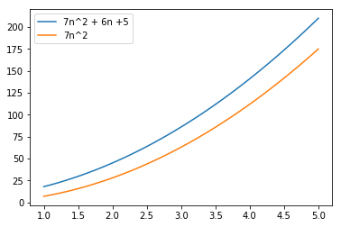


In a larger space of 100 observations they are almost same. Hence the significance of smaller terms are almost none.


```python
n = np.linspace(1, 100)
plt.plot(n, 7*n*n + 6*n + 5, label="7n^2 + 6n +5")
plt.plot(n, 7*n*n , label="7n^2")
plt.legend(loc="upper left")
plt.show()
```


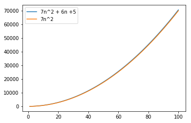


## RULE 1: Multiplicative Constants Can Be Omitted
<font color='blue'>Torment in the dark was the danger that I feared, and it did not hold me back.</font> - **<font color='red'>Gimli</font>**

With the same polynomial equation . 
\begin{equation*}
7n^2 + 6n + 5 = O(n^2)
\end{equation*}
 - lhs grows no faster than n^2  
 - ie Coefficient 7 for the second order item is insignificant

**Same function with a different perspective**  
For absolute amusement let us demonstrate this rule with negative growth. ie
\begin{equation*}
f(n) = \frac{7n^2 + 6n + 5}{7n^2} \\
vs \\
f(n) = \frac{7n^2 + 6n + 5}{n^2} \\
\end{equation*}


```python
plt.plot(n, (7 * n * n + 6 * n + 5)/(7 * n * n), label="7n^2 + 6n +5 / 7n^2")
plt.legend(loc="upper right")
plt.show()
```


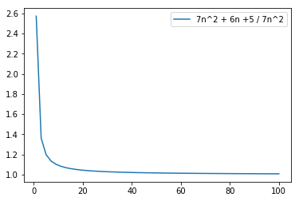


```python
plt.plot(n, (7 * n * n + 6 * n + 5)/(n * n), label="7n^2 + 6n +5 / n^2")
plt.legend(loc="upper right")
plt.show()
```


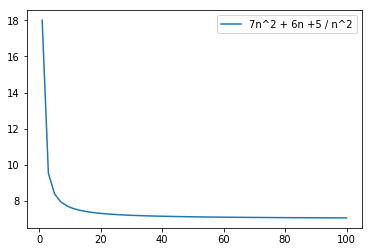


## RULE 2: Out of 2 polynomials, the one with larger degree grows faster
<font color='blue'>Maybe the paths that you each shall tread are already laid before your feet, though you do not see them.</font> - **<font color='red'>Lady Galadriel</font>**

This is one another obvious item in the list of our rules
ie 
\begin{equation*}
n ≺ n^2 ≺ n^3 ≺ n^4
\end{equation*}

In a smaller space comparison of first 3 orders of the growth


```python
n = np.linspace(1, 10)
plt.plot(n, n, label="n")
plt.plot(n, n * n, label="n^2")
plt.plot(n, n * n * n, label="n^3")
plt.legend(loc='upper left')
plt.show()
```


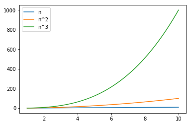


Upto 4th order in a smaller space


```python
n = np.linspace(1, 10)
plt.plot(n, n, label="n")
plt.plot(n, n * n, label="n^2")
plt.plot(n, n * n * n, label="n^3")
plt.plot(n, n * n * n * n, label="n^4")
plt.legend(loc='upper left')
plt.show()
```


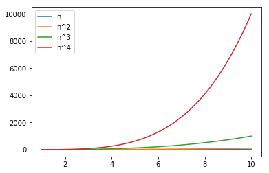


- In a larger space of 100 observations, 3rd order makes its predecessors looks so insignificant
- Needless to demostrate the 4th order


```python
n = np.linspace(1, 100)
plt.plot(n, n, label="n")
plt.plot(n, n * n, label="n^2")
plt.plot(n, n * n * n, label="n^3")
#plt.plot(n, n * n * n * n, label="n^4")
plt.legend(loc='upper left')
plt.show()
```


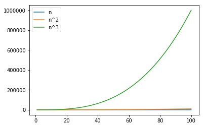


## RULE 3: Any Polynomial grows Slower than Any Exponential
<font color='blue'>Why was I chosen?’ ‘Such questions cannot be answered</font> - **<font color='red'>Gandalf the Grey</font>**

The most deceiving rule is this. One need to observe with a Million X zoom to really catch the critical section of transition. ie
\begin{equation*}
n^4 ≺ 2^n \\
n^3 ≺ 2^n
\end{equation*}

In a smaller space of 10 observation, It is observed
\begin{equation*}
2^n ≺ n^4 
\end{equation*}


```python
n = np.linspace(1, 10)
plt.plot(n, n ** 4, label="n^4")
plt.plot(n, 2 ** n, label="2^n")
plt.legend(loc='upper left')
plt.show()
```


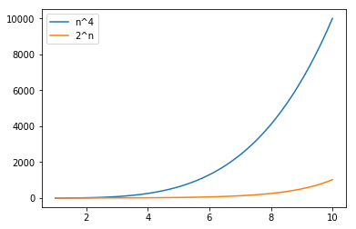


However n^4 is always greater than 2^n. In a different scale of 18 observations
\begin{equation*}
1≤n≤18
\end{equation*}
Exponential takes over at the point of intersection at 16th observeration. ie
\begin{equation*}
2^4 = 4^2
\end{equation*}


```python
n = np.linspace(1, 18)
plt.plot(n, n ** 4, label="n^4")
plt.plot(n, 2 ** n, label="2^n")
plt.legend(loc='upper left')
plt.show()
```


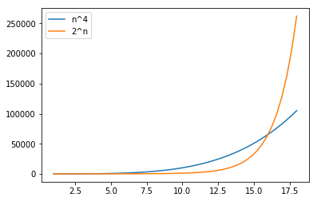


## RULE 4: Any Polyalgorithm grows Slower than Any Polynomial
<font color='blue'>But in the end it’s only a passing thing, this shadow; even darkness must pass.</font> - **<font color='red'>Samwise Gamgee</font>**

Growth of a logrithmic function is always slower than a polynomial
\begin{equation*}
log{(n)}≺n  \\
for  \\
a,b>0 
\end{equation*}


```python
n = np.linspace(1, 20)
plt.plot(n, n, label="n")
plt.plot(n, np.log(n), label="log n")
plt.legend(loc='upper left')
plt.show()
```


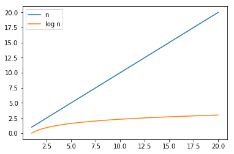


## Square Root vs Log
### $n^{0.5}$ vs $(\log n)^3$
<font color='blue'>It is useless to meet revenge with revenge: it will heal nothing</font> - **<font color='red'>Frodo Baggins</font>**

A mind boggling and exotic example of square root versus logarithm: 
\begin{equation*}
(\log n)^3 \\
vs \\ 
\sqrt{n}
\end{equation*}
(recall that $\sqrt{n}$ is a polynomial function since $\sqrt{n}=n^{0.5}$).

In a smaller space of 3 observations, proved
\begin{equation*}
(\log n)^3 ≺ \sqrt{n}
\end{equation*}


```python
n = np.linspace(1, 3)
plt.plot(n, n ** .5, label="n^.5")
plt.plot(n, np.log(n) ** 3, label="(log n)^3")
plt.legend(loc='upper left')
plt.show()
```


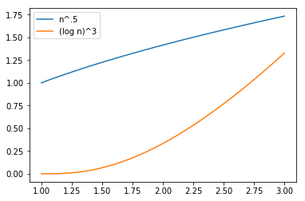


With 5 observations, extremely deceiving

\begin{equation*}
(\log n)^3 > \sqrt{n}
\end{equation*}


```python
n = np.linspace(1, 5)
plt.plot(n, n ** .5, label="n^.5")
plt.plot(n, np.log(n) ** 3, label="(log n)^3")
plt.legend(loc='upper left')
plt.show()
```


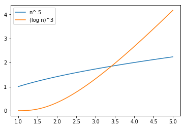


On a larger space of million observations, truth is questioned 


```python
n = np.linspace(1, 10**6)
plt.plot(n, n ** .5, label="n^.5")
plt.plot(n, np.log(n) ** 3, label="(log n)^3")
plt.legend(loc='upper left')
plt.show()
```


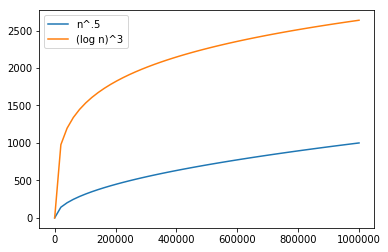


Truth is questioned even at 10s of million observation but there is some hope of convergence in the graph


```python
n = np.linspace(1, 10**7)
plt.plot(n, n ** .5, label="n^.5")
plt.plot(n, np.log(n) ** 3, label="(log n)^3")
plt.legend(loc='upper left')
plt.show()
```


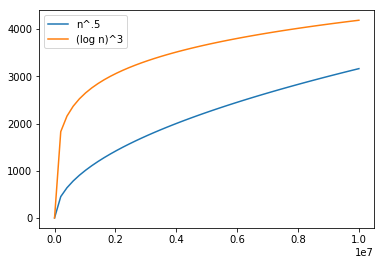


Truth prevails, when we pushed the limit to almost a billion observations


```python
n = np.linspace(1, 10**8)
plt.plot(n, n ** .5, label="n^.5")
plt.plot(n, np.log(n) ** 3, label="(log n)^3")
plt.legend(loc='upper left')
plt.show()
```


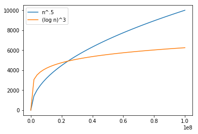


## Fraction vs Log
### $n^{0.1}$ vs $(\log n)^5$
<font color='blue'>Faithless is he that says farewell when the road darkens.</font> - **<font color='red'>Gimli</font>**

Another sample where one can ponder the beauty of nature

**At 100 Observations**


```python
n = np.linspace(1, 100)
plt.plot(n, n ** .1, label="n^.1")
plt.plot(n, np.log(n) ** 5, label="(log n)^5")
plt.legend(loc='upper left')
plt.show()
```


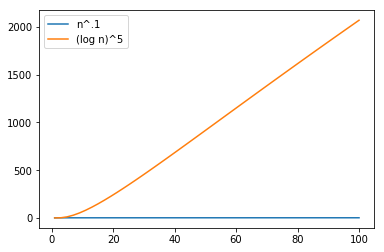


**At 10^125 Observations: Truth Prevails**


```python
n = np.linspace(1, 10**125)
plt.plot(n, n ** .1, label="n^.1")
plt.plot(n, np.log(n) ** 5, label="(log n)^5")
plt.legend(loc='upper left')
plt.show()
```


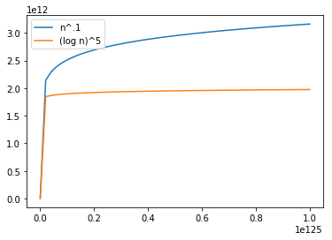


## Inference
<font color='blue'>Courage is the best defense that you have now</font> - **<font color='red'>Gandalf the White</font>**

Through various polynomial functions we demonstrated the limiting behaviour of a function with different sets of arguments and observations space.
This analysis should be foundation for arriving at running time or space requirement while designing a complex data centric operations. By merely expressing the ideas with an arithmatic function, one could understand the larger picture rather than focusing on smalling things.
