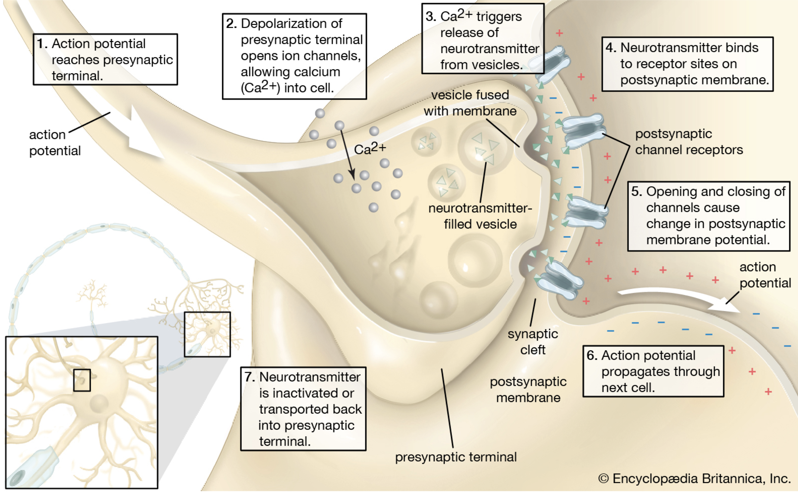
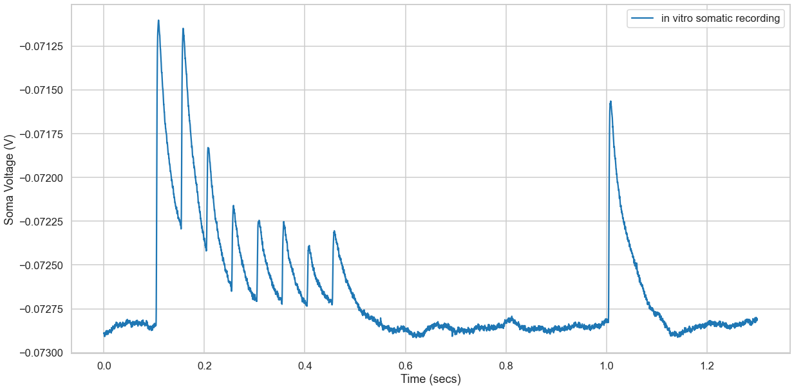
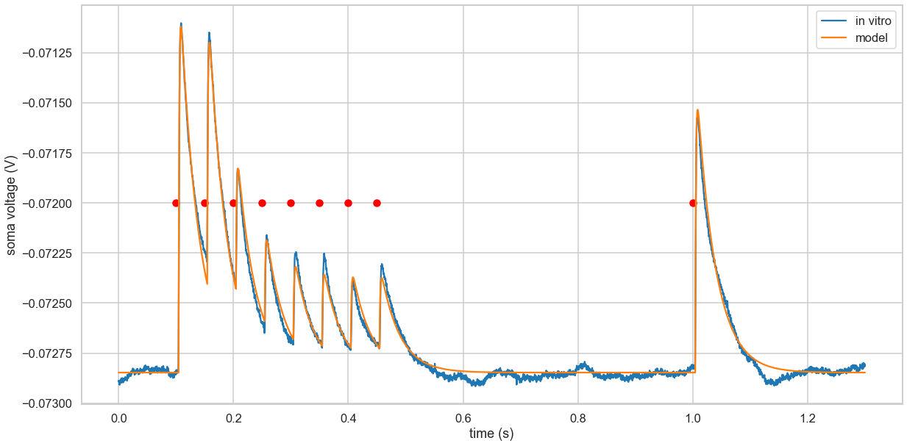

This is an attempt to understand and run a commentary of TM Model proposed by Misha V.Tsodyks and Henry Markram in their 1997 paper named [The neural code between neocortical pyramidal neurons depends on neurotransmitter release probability](https://www.pnas.org/content/94/2/719) that demonstrates the complex computational tasks performed by the synapses in the neocortical pyramidal neuron pairs for a given stimuli. 

### Objective

Objectives that we want to achieve by the end of this write
- Structure and functions of Synapse
- Neurotransmitters and few examples
- Understand Trodyks - Markram Model and its various states
- Deep dive into Kinatic Equations of TM Model
- Programmatically Construct the TM Model
- Visualizing the post synaptic recordings
- Construct the Ordinary Differential Equation that optimizes the key parameters
- Conduct residual analysis on the in vitro recordings and model predictions

### Introduction
Being an electrical engineer, I see a synapse and their attributes are similar to a capacitors of electical subsystems. I confess, often I confuse them with resistors as well - my bad. A simple reason could be the similarity in symbolic representation of a capacitor and structure of a synapes and synaptic cleft. Also, function of synapse and a capacitor identified quite similar. My gut feel, synapses could be the inspiration for the invention of capacitance for the power transmission system by in large. Need to mention, though they are vastly different in their form factor but nothing beyond interms of their functions.


Image Credit: [Encyclopedia Brittanica](https://www.britannica.com/science/synapse)

What Synapses do, they release neurotransmitters using ionic channels via vesicles during presynaptic phase that carry the $Ca^+$ ions to the synapse of the next neuron via synaptic cleft through receptors called post synaptic phase. Similar to the electrical transmission across the grid. To be honest, it is not very difficult for an electrical engineer to comprehend and appreciate the grand design through neurons, ionic channels, impulses and potential differences by an over simplified power transmission system.

It has been estimated a typical human brain has 100 - 400 trillion synapses carrying messages round the clock. I am  sure our telecommunication networks must be ashamed of their capacity and bandwidth that they often try to brag about.

We really do not know how many neurotransmitters are there in the sytsem but a count of 200 could be a good approximation. Following are the few that are commonly known,
- Monamines: Dopamine, Histamine, Serotonin, Epinephrine (adrenaline) etc
- Peptides: Oxytocin, Amphetamine (Is it restoring your memories of breaking bad, you are right there)
- Amino Acids: Glutamate, Glycine


<iframe id="mntl-sc-block-iframe__uri_1-0" width=800 height=600 class="comp biodigital mntl-sc-block-iframe__uri mntl-block lazyloaded" data-src="https://human.biodigital.com/widgets/verywell/?be=30PX&amp;ui-info=false&amp;ui-fullscreen=false&amp;ui-zoom=true&amp;ui-share=false&amp;initial.button=true&amp;uaid=45R0N" frameborder="0" allowfullscreen="true" title="Synapses" src="https://human.biodigital.com/widgets/verywell/?be=30PX&amp;ui-info=false&amp;ui-fullscreen=false&amp;ui-zoom=true&amp;ui-share=false&amp;initial.button=true&amp;uaid=45R0N"></iframe>

## Short-term Synaptic Plasticity (STSP) 
STSP is the short term variations of the synaptic efficacy directly affect the timing and integration of presynaptic inputs to postsynaptic neurons. This is an activity regulatory mechanism that controls the cortical responses to strong stimuli called as `Synaptic Depression`. This biophysical activity works as nonlinear adaptive filters in the visual system for low contrast stimulis and short latency for high contrast stimuli. This triggers some sort of a thought process how contrastive learning of visual representations are quite effective, demonstrated in the famous [SimCLR paper by Simon Kornblith, Geoffrey Hinton et al.](https://arxiv.org/abs/2002.05709)

The stochastic nature of the neurotransmitter release is a function of  various attributes of the synaptic transmission determined experimentally. Understanding the equations provides better insights of the synaptic function of pyramidal neurons taken from the somato sensory cortical area of the wistor rats.

### Somatic Recording Dataset
Tsodyks-Markram model fits the parameters of a given in vitro somatic recording data. The data provided by Rodrigo Perin(EPFL) shows L5TTPC-L5TTPC depression connection trace. This recording is done using a complex process by cutting the sagittal slices of the neocortex of the animal of interest. The details of the experimental setup is provided in the source literature in detail which is beyond the scope of this article. 

Final recordings are provided in pickle format for simulations and experiments. Let us load the data and explore.


```python
%matplotlib inline

import seaborn as sns
import matplotlib.pyplot as plt
import pickle
import numpy as np

# Plotting context and style
sns.set_context('talk')
sns.set_style('whitegrid')
```


```python
somatic_recording = pickle.load(open('trace.pkl', "rb"), encoding='iso-8859-1')
somatic_recording.keys()
```


    dict_keys(['t', 'tstim', 'v'])


We have 3 parameters,
- Time of observation (t)
- Observed Potential (v)
- Time at which a stimuli was given to the neuron pair/cluster (t)


```python
time = somatic_recording['t']
voltage = somatic_recording['v']
time_of_stimuli = somatic_recording['tstim']

print(f'Explore the data: {len(time)}, {len(voltage)}, {len(time_of_stimuli)}')
```

    Explore the data: 13000, 13000, 9


```python
plt.figure(figsize=(20, 10))
#fig, ax = plt.subplots()
plt.plot(somatic_recording['t'], somatic_recording['v'], label="in vitro somatic recording")
#plt.scatter(np.searchsorted(time, time_of_stimuli), time_of_stimuli)
plt.legend(loc=0)
plt.xlabel('Time (secs)')
plt.ylabel('Soma Voltage (V)')
```


    Text(0, 0.5, 'Soma Voltage (V)')





**Observation**  
- We had 9 occassions at which a stimulus was given and 9 peaks are observed
- Last peak indicates the recovery state

### Significant Parameters
Our goal for this notebook is to understand TM Model and not fit the parameters by training. Hence, the model is pre-fit and the optimum parameters are provided as constants. 

**From Data**
- TIME_DELTA, It is the time interval at which the voltage/potential is measured
- N_SAMPLES, Total number of observations made over a period of time
- RESTING_POTENTIAL, Its the mean of resting voltage from $t_0$ to $t_{stimuli_1}$, calculated from the somatic recording dataset


```python
TIME_DELTA = time[1] - time[0]
N_SAMPLES = len(voltage)
voltage_baseline = np.searchsorted(time, time_of_stimuli[0])
RESTING_POTENTIAL = np.mean(voltage[:voltage_baseline])
```

**From Fitted Model**
- T_REC: Recovery time constant in ms
- T_FAC: Facilitation time constant in ms
- ASE: Absolute Synaptic Efficacy
- USE: Utilization of synaptic efficacy. Hs to be in the interval of [0, 1]
- R_INPUT: Input resistance (MOhm)
- T_MEM: Membrane time constant (ms)
- T_INAC: Inactivation time constant
- LATENCY: PSP Latency


```python
# Optimum values from Tsodyks-Markram Model 
T_REC = 415.56
T_FAC = 163.12
ASE = 1877.15
USE = 0.52
R_INPUT = 51.82
T_MEM = 32.79
T_INAC = 1.27
LATENCY = 4.21
```

## The Model
Let us construct the building blocks for the ordinary differential equations to complete the TM Model
- Synaptic connection is characterized by the absolute amount of resurources it has
- The resources can be classified into 3 states and their Kinetic Equations are portrayed in the subsequent sections
    - Recovered State (R)
    - Effective State (E)
    - Inactive State (R)

### Inactive State (I)  
Inactive state is the period when there is no recovery or stimuli is given to the soma.  
$$\Large I = 1 - R - E $$  
$$i.e$$  
$$I = 1 - R(t) - E(t)$$


```python
def calc_inactive_state(R_prev, E_prev):
    return 1 - R_prev - E_prev
```

### Recovered State (R)  
- Each presynaptic AP activates a certain fraction of resources available: Recovered State
    - Results in quickly inactivates with a time constant of about 1 sec  
$$\Large\frac{dR}{dt} = \frac{I}{\tau_{rec}} - U_{SE} \cdot R \cdot \delta(t - t_{AP})$$  
$$i.e.$$ 
$$\frac{dR(t)}{dt} = \frac{1 - R(t) - E(t)}{D} - U(t)R(t)\delta(t - t_{spike})$$
- $\tau_{rec}$ is the time constant of recovery. This is explained below


```python
def activation_fraction(USE_prev, R_prev, AP_prev):
    return USE_prev * R_prev * AP_prev

def calc_recovered_state(R_prev, E_prev):
    recovery = TIME_DELTA * calc_inactive_state(R_prev, E_prev) *  1e3 / T_REC
    return recovery - activation_fraction(USE_prev, R_prev, AP_prev)
```

### Effective State (E)  
- When all the resources are activated by a presynaptice action potential AP: Effective State  
    - Triggers a maximum possible response called Absolute Synaptic Efficacy $A_{SE}$  
$$\Large\frac{dE}{dt} = - \frac{E}{\tau_{inac}} + U_{SE} \cdot R \cdot \delta(t - t_{AP})$$  
$$i.e.$$  
$$\frac{dE(t)}{dt} = - \frac{E}{\tau_{inac}} + U(t)R(t) \delta(t - t_{spike})$$
- $\tau_{inac}$ is the time constant for inactivation
- $t_{spike}$ is the time of stimuli
- $U_{SE}$ is the fraction of $A_{SE}$ utilized. i.e Utilization of synaptic efficacy parameter
- $U_{SE}$ is the synaptic resources available in the recovered state


```python
def calc_effective_state(E_prev, R_prev, USE_prev, AP_prev):
    effect = -TIME_DELTA * E_prev * 1e3 / T_INAC 
    return effect + activation_fraction(USE_prev, R_prev, AP_prev)
```

### Synaptic Efficacy Utilization Factor
- The net post-synaptic somatic current is proportional to the fraction of resources in the effective state, E
- Synaptic input from large populations of neurons are expected to average out the fluctuations and failures
- $U_{SE}$ determines the dynamic behvior of synaptic tranmission, in particular rate of depression

$$\Large\frac{dU(t)}{dt} =  \frac{U_{SE} - U(t)}{\tau_{fac}} + U_{SE}(1 - U(t))\delta(t - t_{spike})$$  
Where $\tau_{fac}$ is the facilitation time constant. Facilitation time contant is the constant from the pre-synaptic phase of the Synaptic Plasticity process


```python
def calc_efficacy_utilization_factor(USE_prev, AP_prev):
    return -TIME_DELTA * (USE_prev - USE) * 1e3 / T_FAC + USE * (1-USE_prev) * AP_prev
```

### Excitatory Post Synaptic Potential

$$\tau_{mem}\frac{dV(t)}{dt} = -V + R_{inp}I_{syn}(t)$$
$$\frac{dV(t)}{dt} = \frac{-V + R_{inp}I_{syn}(t)}{\tau_{mem}}$$
where  $I_{syn}(t)=A_{SE}E(t)$
$$\Large\frac{dV(t)}{dt} = \frac{-V + R_{inp}A_{SE}E(t)}{\tau_{mem}}$$

Where,
- ASE: Absolute Synaptic Efficacy
- Rinput: Input resistance (MOhm)
- Tmem: Membrane time constant (ms)


```python
def calc_post_synaptic_voltage(V_prev, E_prev):
    return TIME_DELTA * (R_INPUT * ASE / 10 ** 6 * E_prev - V_prev) * 1e3 / T_MEM
```

### TM Model Ordinary Differential Equation


```python
AP = np.zeros(N_SAMPLES) # Action Potential
I = np.zeros(N_SAMPLES) # Inactive State
R = np.zeros(N_SAMPLES) # Recovery State
E = np.zeros(N_SAMPLES) # Effective State
U = np.zeros(N_SAMPLES) # Synaptice Efficacy Utilization Factor
P = np.zeros(N_SAMPLES) # Excitatory Post-synaptic Potential

# Set stimuli in AP vector
psp_offset = int(np.round(1e-3 * LATENCY / TIME_DELTA))
# At what index the stimuli was given from the data
time_of_stimuli_idx = np.searchsorted(time, time_of_stimuli)
AP[time_of_stimuli_idx + psp_offset] = 1

R[0] = 1
E[0] = 0
P[0] = 0
U[0] = USE

# Integrate TM model ODE
for i in range(1, N_SAMPLES):
    R_prev = R[i-1]
    E_prev = E[i-1]
    USE_prev = U[i-1]
    AP_prev = AP[i-1]
    P_prev = P[i-1]

    R[i] = R_prev + calc_recovered_state(R_prev, E_prev)
    E[i] = E_prev + calc_effective_state(E_prev, R_prev, USE_prev, AP_prev)
    U[i] = USE_prev + calc_efficacy_utilization_factor(USE_prev, AP_prev)
    P[i] = P_prev + calc_post_synaptic_voltage(P_prev, E_prev)

P = P + RESTING_POTENTIAL
E = E * ASE / 10**12
I = 1 - R - E
tm_statevar = {
    'recovered': R,
    'effective': E,
    'used': U,
    'inactive': I
}
```


### Model vs In Vitro Recordings


```python
fig, ax = plt.subplots(figsize=(20, 10))
ax.plot(time, voltage, label='in vitro')
ax.plot(time, P, label='model')
ax.scatter(time_of_stimuli, np.tile(-0.0720, len(time_of_stimuli)), c='red')
ax.legend(loc=0)
ax.set_xlabel('Time (s)')
ax.set_ylabel('Soma Voltage (V)')
```


    Text(0, 0.5, 'soma voltage (V)')





### Residual Analysis


```python
# Compute time windows where to compare model and data
offset = 0.005
window = 0.04
window_samples = int(np.round(window/TIME_DELTA))
psp_start = np.searchsorted(time, time_of_stimuli + offset)
psp_stop = psp_start + window_samples
# Extend the last window sample
psp_stop[-1] += 2 * window_samples 

```


```python
errors = [np.linalg.norm(voltage[t0:t1] - P[t0:t1])
                  for t0, t1 in zip(psp_start, psp_stop)]
```


```python
errors
```


    [0.0007234243428066414,
     0.0004888662691707077,
     0.0010873177825812125,
     0.0008418253850070241,
     0.0006462322236686935,
     0.0007670816927837292,
     0.0008081681717810904,
     0.000832403020059831,
     0.0014329186972264394]


## Inference
Have we accomplished the following objectives that we have set...
- Structure and functions of Synapse - Yes
- Neurotransmitters and few examples - Yes
- Understand Trodyks - Markram Model and its various states - Yes
- Deep dive into Kinetic Equations of TM Model - Yes
- Programmatically Construct the TM Model - Yes
- Visualizing the post synaptic recordings - Yes
- Construct the Ordinary Differential Equation that optimizes the key parameters - Yes
- Conduct residual analysis on the in vitro recordings and model predictions - Yes

### References
- [The neural code between neocortical pyramidal neurons depends on neurotransmitter release probability](https://www.pnas.org/content/pnas/94/2/719.full.pdf)
- [Short-term synaptic plasticity in the deterministic Tsodyks–Markram model leads to unpredictable
network dynamics](https://arxiv.org/pdf/1309.7966.pdf)
- [Synapses in the Nervous System - Where Nerve Impulses Are Passed from Neuron to Neuron](https://www.verywellhealth.com/synapse-anatomy-2795867)
- [Tsodyks-Markram model of short-term synaptic plasticity](https://github.com/BlueBrain/BluePyOpt/blob/master/examples/tsodyksmarkramstp/tsodyksmarkramstp.ipynb)

<pre><code>
@ARTICLE{bluepyopt,
AUTHOR={Van Geit, Werner  and  Gevaert, Michael  and  Chindemi, Giuseppe  and  Rössert, Christian  and  Courcol, Jean-Denis  and  Muller, Eilif Benjamin  and  Schürmann, Felix  and  Segev, Idan  and  Markram, Henry},
TITLE={BluePyOpt: Leveraging open source software and cloud infrastructure to optimise model parameters in neuroscience},
JOURNAL={Frontiers in Neuroinformatics},
VOLUME={10},
YEAR={2016},
NUMBER={17},
URL={http://www.frontiersin.org/neuroinformatics/10.3389/fninf.2016.00017/abstract},
DOI={10.3389/fninf.2016.00017},
ISSN={1662-5196}
}
</code></pre>


```python

```
